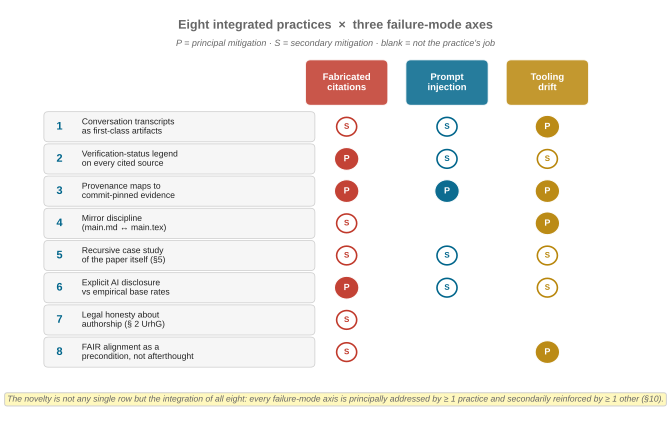
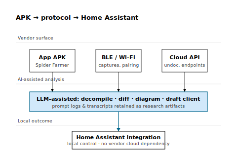
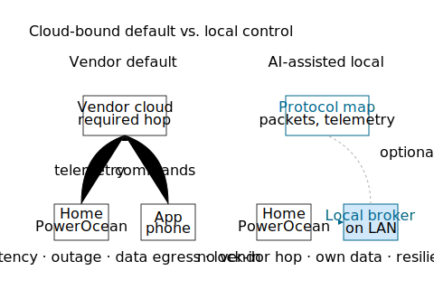
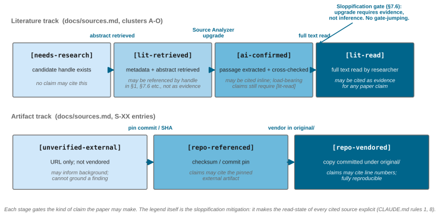
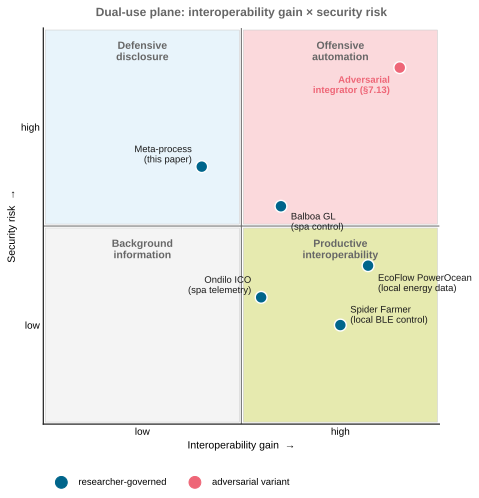
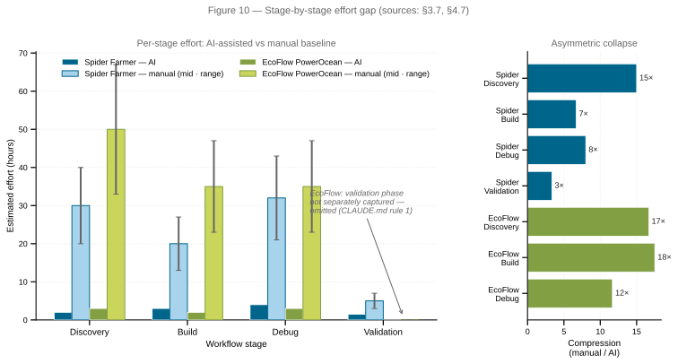
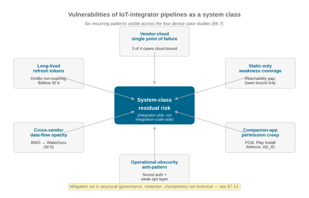
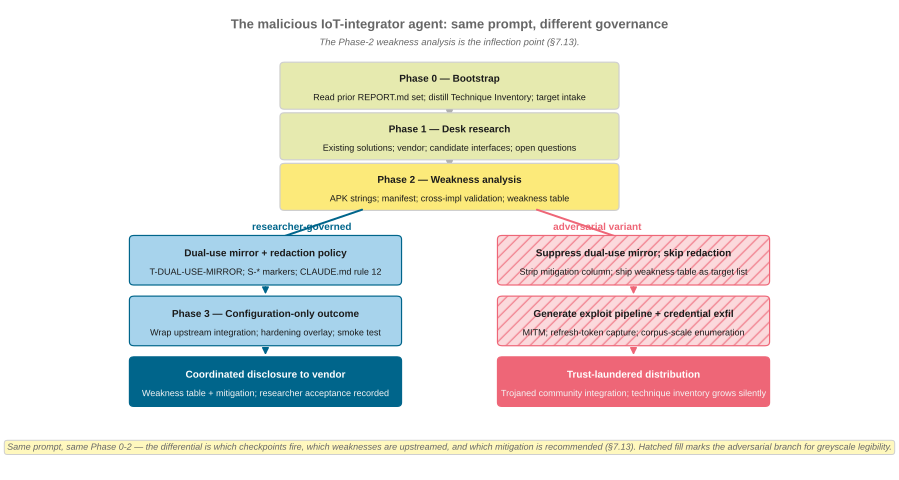

<p align="center">
  
</p>

# Obscurity Is Dead

### Proprietary by Design. Open by AI.

> *AI-assisted reverse engineering as a means to interoperability — and the security nightmare that comes with it.*

**TL;DR.** Consumer-IoT security has long rested on an *effort gap*: the cost of decompiling APKs and reconciling undocumented protocols was high enough to deter casual researchers. Large language models compress that gap by an order of magnitude — asymmetrically faster for interoperability than for exploitation. This repository is the paper *and* every artifact behind it: case studies, AI transcripts, provenance maps, build pipeline.

[](LICENSE)
[](docs/fair.md)
[](paper/main.tex)
[](https://github.com/noheton/Obscurity-Is-Dead/actions/workflows/build-paper.yml)
[](paper/main-condensed.tex)
[](paper/figures/)
[](experiments/)

**Author:** Florian Krebs · [ORCID 0000-0001-6033-801X](https://orcid.org/0000-0001-6033-801X) · *Independent researcher (personal capacity).*
This is a hobbyist project. It is **not** part of, endorsed by, funded by, or representative of any employer, including the German Aerospace Center (DLR). See `paper/main.md` §9.5.

---

## Visual abstract



> *Eight practices · three failure modes · one auditable workflow. Full registry: `paper/main.md` §10.*

---

## Headline numbers

| | Spider Farmer | EcoFlow PowerOcean | Meta-process (this paper) |
|---|---|---|---|
| **Defence model** | AES-128-CBC keys/IVs hardcoded in APK | 3 undocumented API surfaces; vendor docs cover only 1 | None — open by construction |
| **AI-assisted effort** | ~10.5 h across 7 transcripts | ~8 h across 3 transcripts | ~17.5 h (running) |
| **Estimated manual baseline** | 60–120 h | 80–160 h | ~300 h |
| **Effort-gap compression** | **~12 %** of manual | **~7 %** of manual | **~6 %** of manual |
| **Live credentials exposed** | Yes (MQTT) — redacted | No (token-bearer) | N/A |
| **Dual-use blast radius** | Per-device horticulture control | Grid-in / battery-reserve / EV-charger writes | Fabricated citations, unsourced legal opinions, redaction failures |

Source: `paper/main.md` §3.7, §4.7, §5.7, §6.1.

### Cross-validation — IoT-Integrator runs (§6.5)

| | Ondilo ICO Spa V2 | Balboa Gateway Ultra (BWG 59303) |
|---|---|---|
| **Defence model** | Conventional OAuth2; non-expiring refresh tokens dominate residual risk | Cryptographically sound AWS Cognito us-west-2; weak operational layer (broken intermediate-CA chain, `TrustAllStrategy` symbol, public mobile client secret) |
| **Primary AI lift** | Manifest-permission audit; existing-solutions enumeration; technique-inventory bootstrap | Static APK analysis; cross-implementation validation against ES-6; identification of endpoints absent from any open-source library |
| **Phase 3 outcome** | Configuration-only: upstream `ondilo_ico` integration + operational notes + smoke test | Configuration-only: upstream `[REDACTED:repo-path:BALBOA-UPSTREAM-1]` + six-control hardening overlay (C-1..C-6) + smoke test |
| **Dual-use blast radius** | Bounded read-only telemetry | Full ControlMySpa control surface + cross-vendor data flow to WaterGuru |
| **Composite difficulty** (§6.6) | Easy | Medium |
| **Validation status** | Cross-validation; researcher-side device tests `T-OND-1..T-OND-10` pending | Cross-validation; researcher-side device tests `T-BAL-1..T-BAL-12` pending |

These two cases enter the paper as evidence for the methodology's *transferability* rather than as independent confirmation of the central thesis (§6.5, §8 limitation 3). They place a useful spread on the obscurity-vs-authentication axis: Spider Farmer (no auth) → Balboa (sound auth, weak operational layer) → Ondilo (clean OAuth2) → EcoFlow (multiple authenticated surfaces).

| | |
|---|---|
|  |  |
| **Fig 1** — The effort gap (data: `figures/data/effort-gap.csv`). | **Fig 2** — The boredom barrier: AI lowers *Eₐ*. |

---

## What is this?

A research paper **and** its full evidence trail — case studies, AI conversation transcripts, provenance maps, figure-generation scripts — published as a single, auditable, git-tracked artifact.

**Central thesis.** The dominant security posture for consumer IoT is economic, not cryptographic. Proprietary protocols and obfuscated APKs raise the *effort gap* high enough that a casual researcher gives up. LLMs collapse that gap. We document *how far* it has collapsed, *how asymmetrically*, and *what to do about it*.

**The §8 ask.** Don't inherit AI-research norms — *generate* them, now, while the practice is still being formed. The conclusion (`paper/main.md` §8) makes a four-part move: a terminological precision (broad-AI vs Gen-AI), a call-to-action to treat methodological norm-setting as itself a research activity, an invitation to AI-skeptics as co-norm-setters rather than opponents, and a candidate **FAIR for AI-Assisted Research** (working name **FAIR4AI**) extension that maps the eight integrated practices in §10 onto Findable / Accessible / Interoperable / Reusable. FAIR4RS [Chue Hong et al., 2022] and FAIR4ML [RDA, 2024] cover research software and ML models; neither yet covers AI-mediated research *processes* — exportable transcripts, versioned prompts, verification-status ladders, structured redaction. We propose the name and surrender it to the community.

**Read the paper:**

| Artifact | Markdown source | LaTeX source | Notes |
|----------|----------------|--------------|-------|
| Long-form (canonical) | [`paper/main.md`](paper/main.md) | [`paper/main.tex`](paper/main.tex) | Full paper; arXiv-ready; CI-built PDF via [Build paper workflow](https://github.com/noheton/Obscurity-Is-Dead/actions/workflows/build-paper.yml) |
| Condensed (venue submission) | [`paper/main-condensed.md`](paper/main-condensed.md) | [`paper/main-condensed.tex`](paper/main-condensed.tex) | ≤ 10 pages; derivative of long-form; headline-KPI table as Fig 1 |

Both artifacts are labelled *draft* until the author authorises submission (rule 13).

---

## More figures

<details>
<summary><b>Case studies, methodology, synthesis</b> — click to expand</summary>

| | |
|---|---|
|  |  |
| **Fig 3** — Spider Farmer pipeline. | **Fig 4** — EcoFlow architectures. |
|  |  |
| **Fig 5** — Acquire → Analyse → Audit → Validate. | **Fig 9** — Two-track verification. |
|  |  |
| **Fig 6** — Dual-use outcome map. | **Fig 10** — Where the gap actually compresses. |
|  |  |
| **Fig 13** — Pipeline-class vulnerabilities synthesised across the four device cases (§6.7). | **Fig 14** — Researcher-governed vs. adversarial IoT-Integrator branches (§7.13). |

The full inventory (Figs 7, 8, 12, 15, 16, plus the Pandora bookend) lives in [`paper/figures/README.md`](paper/figures/README.md).

</details>

---

## Repository layout

```
paper/         # main.md, main.tex (rule-11 mirror), references.bib, Makefile, figures/
experiments/   # spider-farmer/, ecoflow-powerocean/,
               # iot-integrator-ondilo-ico-spa-v2/, iot-integrator-balboa-gateway-ultra/,
               # paper-meta-process/
docs/          # methodology, sources, logbook, fair, redaction-policy, ethics, prompts/
CITATION.cff · .zenodo.json · codemeta.json · LICENSE · CLAUDE.md
```

---

## Reproducibility & build

Every technical claim is **traceable** to a file/line in `experiments/*/original/` at commit `ffdf60c`, **transcript-anchored** in `experiments/*/raw_conversations (copy&paste, web)/`, and **verification-status labelled** (`[repo-vendored]` / `[lit-read]` / `[lit-retrieved]` / `[unverified-external]`). AI outputs are never used as authority — only as claims to be checked against vendor code.

```bash
make -C paper check     # verify toolchain (TeX Live, latexmk, rsvg-convert)
make -C paper figures   # SVG → PDF
make -C paper pdf       # build main.pdf (long-form)
make -C paper condensed # build main-condensed.pdf (venue submission, ≤10pp)
make -C paper all       # build both artifacts in sequence
```

> **Publication warning (rule 13).** `make arxiv` packages a submission tarball *for local review only*. Never upload, push to a public mirror, or submit without explicit written consent from the author.

---

## Citation

```bibtex
@misc{krebs2026obscurity,
  author       = {Krebs, Florian},
  title        = {AI-Assisted Hacking: Key to Interoperability or Security Nightmare?},
  year         = {2026},
  howpublished = {\url{https://github.com/noheton/Obscurity-Is-Dead}},
  note         = {ORCID: 0000-0001-6033-801X. Independent researcher (personal capacity).
                  Preprint. Zenodo DOI pending first release.}
}
```

Machine-readable: [`CITATION.cff`](CITATION.cff) · [`.zenodo.json`](.zenodo.json) · [`codemeta.json`](codemeta.json).

---

## License & FAIR

Human-authored portions: [CC-BY-4.0](LICENSE). Excluded: vendor binaries/docs under `experiments/*/original/doc/` (own copyrights — see `docs/sources.md`) and items in `docs/redaction-policy.md` (git-history rewrite required before any public archive). AI-generated text is acknowledged but not a copyrightable contribution under § 2 UrhG; see paper §9.1.

[](docs/fair.md)
[](docs/fair.md)
[](docs/fair.md)
[](docs/fair.md)

Full F1–R1.3 mapping and open compliance issues in [`docs/fair.md`](docs/fair.md).

---

## Status — public-mirror readiness (2026-05-04)

| | |
|---|---|
| Working-tree redaction (rule 12) | **done** — paper text, handbacks, vendored design bundle, EcoFlow serials, logbook handles all redacted in-place; full register in [`docs/redaction-policy.md`](docs/redaction-policy.md); audit trail in [`docs/redaction-audit-2026-05-03.md`](docs/redaction-audit-2026-05-03.md). |
| Git history rewrite (rule 12 / 13) | **executed** (2026-05-04) — see `paper/main.md` §5.6 for the canonical narrative; catalogue at [`docs/git-history-rewrite-plan.md`](docs/git-history-rewrite-plan.md); rewrite tip tagged `pre-publication-clean`; `git log --all -S "<raw>"` returns zero commits for every catalogued raw value. One residual surface, the vendored zip carve-out, is recorded under the table.<sup>†</sup> |
| Upstream `noheton/spider_farmer` and `noheton/powerocean-dev` | **redaction pass not yet run on the upstreams** — `scripts/import-experiments.sh` clones them into `experiments/*/original/`, but the upstreams themselves still hold their pre-redaction history (see `paper/main.md` §5.6). Each needs its own `git-filter-repo` pass against the same catalogue before being made public. |
| Public-mirror push / Zenodo / arXiv | **blocked** on the upstream-redaction pass and on a separate explicit consent (rule 13). The CI Build-paper workflow produces draft artifacts only. |

<sup>†</sup> *Vendored zip carve-out (acknowledged, not a gating step):* the three Spider Farmer archives `experiments/spider-farmer/original/doc/{esphome-spiderfarmer_ble-encrypt,[REDACTED:repo-path:SF-IMPL-2]-master,[REDACTED:repo-path:SF-IMPL-3]-main}.zip` retain maintainer / repo strings inside packed entries (`--replace-text` does not descend into binary blobs); the public-mirror cut-over decides whether to drop the archives or ship them with a documented caveat.

---

## Contribute — open an issue, change the paper

This project is designed to be argued with. The agent pipeline in [`docs/prompts/`](docs/prompts/) treats GitHub issues as **first-class inputs**: an issue you open here is a prompt for the next pass of the pipeline, not a wishlist item that goes to a backlog and dies.

Three labels route issues into specific pipeline stages — pick the one that fits your contribution:

| Label | What it means | Where it goes |
|-------|---------------|----------------|
| [`idea`](https://github.com/noheton/Obscurity-Is-Dead/issues/new?labels=idea) | A hypothesis, device, paper, or framing worth investigating. *"What if you tested X?"* / *"Have you seen this 2025 paper that contradicts §6.4?"* | **Stage 1 — Research Protocol.** A research pass is dispatched against the issue body; results land in [`docs/sources.md`](docs/sources.md), [`docs/logbook.md`](docs/logbook.md), and (if material) the paper. The issue number is cited in every artifact the pass produces. |
| [`critique`](https://github.com/noheton/Obscurity-Is-Dead/issues/new?labels=critique) | A specific challenge to a claim, figure, citation, or framing. *"§7.7 overstates model collapse — here's the counter-evidence."* / *"Figure 11 misreads its own data."* | **Stage 2 — Scientific Writer** (default). The issue body becomes a writer hand-back; the writer revises the paper and replies on the issue with the commit SHA that closes (or contests) the critique. Layout- or readability-only critiques may be re-routed to Stage 4/5. |
| [`provenance-gap`](https://github.com/noheton/Obscurity-Is-Dead/issues/new?labels=provenance-gap) | A missing transcript, an unreachable artifact, an unverifiable claim. *"The v2→v3 migration has no transcript"* (this is a real example — see §3.4). | **Stage 1 — Research Protocol** targeted at the named experiment, **plus** a meta-process note in §5. Closure means either the gap is filled, or it is explicitly named in the paper as outstanding (rule 1: honesty about what we can't reconstruct). |

Disagreement is the most useful kind of contribution. The transcript-as-artifact discipline ([rule 4 in `CLAUDE.md`](CLAUDE.md)) means every claim in the paper is backed by an exportable conversation log committed in this repository — so an objection can land on a specific line, transcript, or commit rather than on vibes.

> Quick start: open an issue with one of the three labels above. The orchestrator polls open issues at the start of every pipeline run; your input shows up in the next dispatch directive.

---

## How this README stays honest

This is the flashy front door of [`paper/main.md`](paper/main.md). Per **rule 15** of [`CLAUDE.md`](CLAUDE.md), title, thesis, headline KPIs, and figure inventory must be updated in the same commit that the paper changes any of them. If this page contradicts the paper, the paper wins — please open an issue (`critique` label).

*Obscurity is dead. What replaces it has to be designed, not assumed.*
