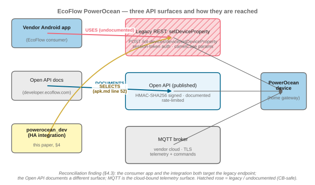
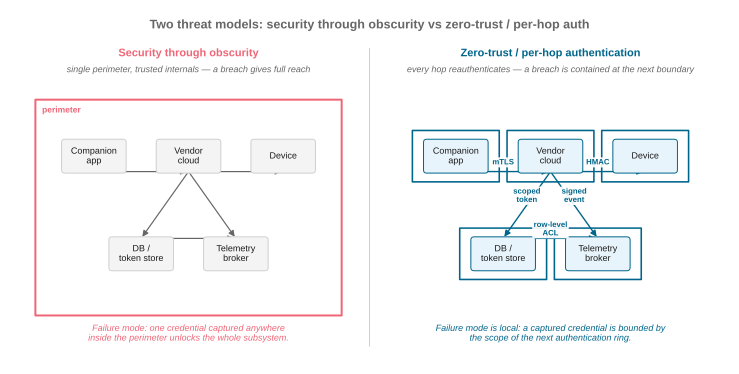
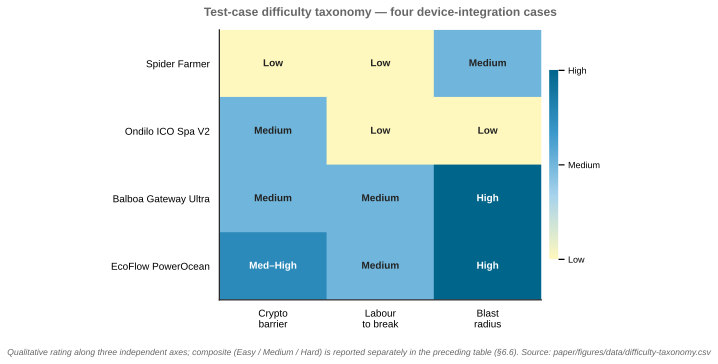
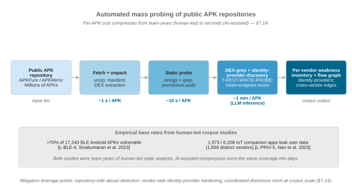
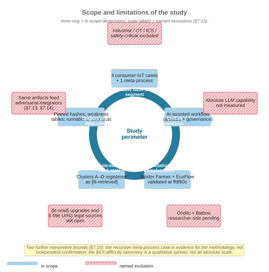

# Obscurity Is Dead

### Proprietary by Design. Open by AI.

> *A study of AI-assisted reverse engineering as a means to interoperability — and the security nightmare that comes with it.*

![Obscurity Is Dead — project logo. Shattered-Pandora-jar motif over a dark slate background; binary-shard rays expand from the broken seal toward an "AI" wordmark. Tagline: "Proprietary by Design. Open by AI." Concept: the shattered jar, founded on collapsed effort gaps. Logo generated by Google Gemini at the author's request, 2026-05-02. The image file is dropped into `paper/figures/logo-obscurity-is-dead.png` by the researcher; until then this link renders as a broken image and that broken state is intentional (rule 1: AI contributions are visibly labelled).](paper/figures/logo-obscurity-is-dead.png)

**Author:** Florian Krebs &nbsp;·&nbsp; [ORCID 0000-0001-6033-801X](https://orcid.org/0000-0001-6033-801X) &nbsp;·&nbsp; *Independent researcher (personal capacity)*

[](LICENSE)
[](docs/fair.md)
[](paper/main.tex)
[](https://github.com/noheton/Obscurity-Is-Dead/actions/workflows/build-paper.yml)
[](paper/figures/)
[](experiments/)

> **Statement of independence.** This is a hobbyist research project carried out by the author in a personal capacity. It is **not** part of, endorsed by, funded by, or representative of the views of any employer, including the German Aerospace Center (DLR). See `paper/main.md` §9.5 for the full disclaimer.

---

## Visual abstract


> *Eight practices · three failure modes · one auditable workflow. The full registry lives in `paper/main.md` §10.*

---

## What is this?

This repository is a research paper **and** its full supporting evidence — case studies, AI conversation transcripts, provenance maps, and methodology — published as a single, auditable, git-tracked artifact.

> **Central thesis.** The dominant security posture for consumer IoT is economic, not cryptographic: proprietary protocols and obfuscated APKs raise the *effort gap* high enough that a casual researcher gives up. Large language models collapse that gap. This paper documents *how far* it has collapsed, *how asymmetrically* (faster for interoperability than for exploitation), and *what to do about it*.

| | |
|---|---|
|  |  |
| **Fig 1** — The effort gap collapses with AI assistance (data-driven, `data/effort-gap.csv`). | **Fig 2** — The boredom barrier: AI lowers the activation energy *Eₐ*. |

---

## Key findings at a glance

| | Spider Farmer | EcoFlow PowerOcean |
|---|---|---|
| **Defence model** | AES-128-CBC keys/IVs hardcoded in APK | 3 undocumented API surfaces; vendor docs cover only one |
| **AI-assisted effort** | ~10.5 h across 7 transcripts | ~8 h across 3 transcripts |
| **Estimated manual effort** | 60–120 h | 80–160 h |
| **Effort-gap compression** | ~12% of manual | ~7% of manual |
| **Live credentials exposed** | Yes (MQTT broker) — redacted | No (token-bearer model) |
| **Dual-use blast radius** | Per-device horticulture control | Grid-in / battery-reserve / EV-charger writes |


*Fig 10 — Where the gap actually compresses: per-stage effort, AI vs. manual, across both case studies.*

---

## Visual tour of the paper

The figures are grouped here the way the paper uses them: thesis → case studies → methodology → synthesis. The full inventory and Rule-14 compliance notes live in [`paper/figures/README.md`](paper/figures/README.md).

### Case studies (§3, §4)

| | |
|---|---|
|  |  |
| **Fig 3** — Spider Farmer: vendor surface → local HA integration. | **Fig 4** — EcoFlow: cloud-bound vs. local-broker architectures. |
|  | |
| **Fig 8** — EcoFlow's three API surfaces (consumer / docs / integration mapping; ILL-02). | |

### Methodology (§2, §5, §7.6)

| | |
|---|---|
|  |  |
| **Fig 5** — Four-stage pipeline: Acquire → Analyse → Audit → Validate. | **Fig 9** — Verification-status pipeline (ILL-03). |

### Synthesis (§6, §7, §8)

| | |
|---|---|
|  |  |
| **Fig 6** — Dual-use outcome map. | **Fig 7** — Perimeter model vs. per-hop authenticated model. |
|  |  |
| **Fig 12** — Difficulty taxonomy across four cases (ILL-06). | **Fig 13** — System-class vulnerabilities of IoT-integrator pipelines (ILL-07). |
|  |  |
| **Fig 14** — Malicious IoT-integrator agent (ILL-08). | **Fig 15** — Automated mass probing of public APK repositories (ILL-09). |
|  |  |
| **Fig 16** — Scope and limitations of the study (ILL-10). | **Pandora — intact** — Hesiodic counterpoint to the shattered-jar logo, anchored at §10 (Gemini, 2026-05-02). |

---

## Repository structure

```
Obscurity-Is-Dead/
├── paper/
│   ├── main.md              # Canonical paper source (Markdown)
│   ├── main.tex             # arXiv-ready LaTeX mirror (rule 11: must stay in sync)
│   ├── references.bib       # BibTeX bibliography
│   ├── Makefile             # Build pipeline: make pdf | make figures | make arxiv
│   └── figures/             # SVG figures (fig1–fig16) + Gemini logos + scripts + data + README
├── experiments/
│   ├── spider-farmer/       # Case study 1: artifacts, transcripts, provenance
│   ├── ecoflow-powerocean/  # Case study 2: artifacts, transcripts, provenance
│   └── paper-meta-process/  # Case study 3 (recursive): paper-generation pipeline
├── docs/
│   ├── methodology.md       # Research workflow and KPI framework
│   ├── sources.md           # Literature register with verification-status legend
│   ├── logbook.md           # Session-by-session development changelog
│   ├── fair.md              # FAIR principles compliance mapping
│   ├── redaction-policy.md  # Sensitive-item register and pre-publication checklist
│   ├── ethics.md            # Ethical considerations and dual-use framing
│   └── prompts/             # Three-stage agent pipeline (research / writer / illustration)
├── CITATION.cff             # Citation File Format 1.2.0
├── .zenodo.json             # Zenodo metadata (for DOI minting)
├── codemeta.json            # CodeMeta 3.0 / schema.org JSON-LD
├── LICENSE                  # CC-BY-4.0 (human-authored portions only)
└── CLAUDE_CODE_INSTRUCTIONS.md  # Canonical AI policy (15 rules)
```

---

## Reading the paper

- **Markdown source**: [`paper/main.md`](paper/main.md) — readable in any Markdown renderer.
- **Draft PDF (CI build)**: latest CI-built draft is published as the `paper-pdf` artifact of the [Build paper workflow](https://github.com/noheton/Obscurity-Is-Dead/actions/workflows/build-paper.yml) — open the most recent successful run and download the artifact. Labelled *draft* until the author authorises submission (rule 13).
- **Local build**: [`paper/main.pdf`](paper/main.pdf) — present only when built locally (gitignored by default; see [`paper/Makefile`](paper/Makefile)). Build with `make -C paper pdf` (requires TeX Live + `rsvg-convert` or `inkscape`).
- **Section guide**:
  - §1 Introduction and Motivation — the effort-gap concept and research question
  - §2 Methodology — auditable AI-assisted RE workflow
  - §3–4 Case studies — Spider Farmer and EcoFlow PowerOcean
  - §5 Meta-process — the paper itself as a third case study
  - §6 Synthesis — cross-case comparison and limits
  - §7 Discussion — interoperability, asymmetry, proliferation risk, prompt-injection countermeasure
  - §9 AI usage disclosure — model acknowledgement, legal framing, independence
  - §10 The Pandora moment — artifact-level disclosure as a research methodology (visual abstract, Fig 11)

---

## Reproducibility

Every technical claim is:
1. **Traceable** — mapped to a specific file and line number in `experiments/*/original/` at commit `ffdf60c`.
2. **Transcript-anchored** — the AI conversation that proposed it is preserved in `experiments/*/raw_conversations (copy&paste, web)/`.
3. **Verification-status labelled** — `[repo-vendored]` / `[lit-read]` / `[lit-retrieved]` / `[unverified-external]` as appropriate (see `docs/sources.md` legend).

AI outputs are **never used as authority** — only as claims to be checked against vendor code. The two-track verification pipeline (literature + artifact, converging at the sloppification gate) is depicted in **Fig 9** above.

---

## Build the paper

```bash
# Prerequisites: TeX Live, latexmk, rsvg-convert (or inkscape)
make -C paper check        # verify toolchain
make -C paper figures      # SVG → PDF (required before first pdf build)
make -C paper pdf          # build main.pdf
```

> **Publication warning (rule 13):** `make arxiv` packages a submission tarball for *local review only*. Never upload or submit without explicit written consent from the author. See `paper/Makefile` for the full pre-publication checklist.

---

## Citation

```bibtex
@misc{krebs2026obscurity,
  author       = {Krebs, Florian},
  title        = {AI-Assisted Hacking: Key to Interoperability or Security Nightmare?},
  year         = {2026},
  howpublished = {\url{https://github.com/noheton/Obscurity-Is-Dead}},
  note         = {ORCID: 0000-0001-6033-801X. Independent researcher (personal capacity).
                  Preprint. Zenodo DOI pending first release.}
}
```

Citation metadata is also available in machine-readable formats: [`CITATION.cff`](CITATION.cff), [`.zenodo.json`](.zenodo.json), [`codemeta.json`](codemeta.json).

---

## License

The human-authored and human-curated portions of this repository are licensed under [CC-BY-4.0](LICENSE).

**Exclusions** (not covered by the CC-BY-4.0 grant):
- Vendor binaries and documentation under `experiments/*/original/doc/` — each carries its own copyright and redistribution caveats (see `docs/sources.md`).
- Items flagged for redaction in `docs/redaction-policy.md` (live credentials in prior git history — git history rewrite required before any public archive).

AI-generated text is acknowledged but is not a copyrightable contribution under § 2 UrhG (*persönliche geistige Schöpfung*). See §9.1 of the paper for the full discussion.

---

## FAIR compliance

[](docs/fair.md)
[](docs/fair.md)
[](docs/fair.md)
[](docs/fair.md)

See [`docs/fair.md`](docs/fair.md) for the full F1–R1.3 compliance mapping and the open issues blocking full compliance (notably: Zenodo DOI, git history rewrite, vendor redistribution).

---

## How this README stays honest

This README is the flashy front door of `paper/main.md`. Per **rule 15** of the repository AI policy (`CLAUDE.md`), it must mirror the paper's title, thesis, headline KPIs, and figure inventory in the same commit that any of those change in the paper. Title, thesis, and KPI table above are pulled from `paper/main.md` §1 and §6.1; every figure is rendered straight from `paper/figures/`. If you spot a contradiction between this page and the paper, the paper wins — and please open an issue.

---

*Obscurity is dead. What replaces it has to be designed, not assumed.*
