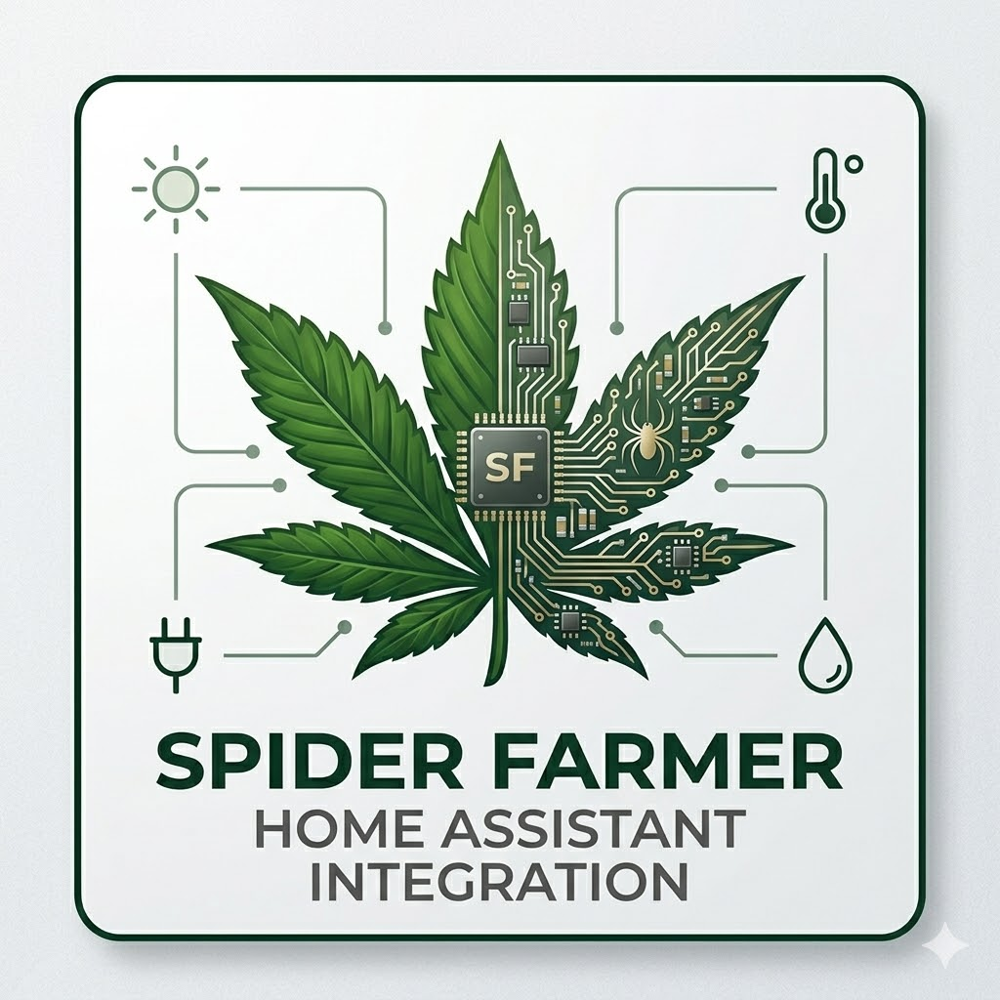

<p align="center">
  
</p>

# SpiderFarmer Home Assistant Custom Component

This integration allows for local control of the **SpiderFarmer SF-GGS-CB** controller by intercepting its MQTT traffic. By redirecting the controller to a local broker, you can bypass the SpiderFarmer cloud and manage your grow environment directly via Home Assistant.

> [!CAUTION]
> this is a AI summary of my notes.

---

## ⚠️ Disclaimer
> [!CAUTION]
> This documentation is a technical summary of experimental findings. Implementing this requires advanced networking knowledge (DNS rewriting) and manual certificate management.

---

## 🚀 Installation

1. Clone this repository into your Home Assistant `custom_components` directory:
   ```bash
   cd /config/custom_components
   git clone https://github.com/your-repo/spider_farmer
   ```
2. Restart Home Assistant.

---

## 🛠️ Connection Architecture

The controller is designed to connect to SpiderFarmer's official servers. To gain local control, you must "spoof" the official infrastructure on your local network.

* **Official Endpoint:** `sf.mqtt.spider-farmer.com`
* **Target Port:** `8333`
* **Method:** **DNS Rewrite**. Configure your router or DNS server (AdGuard Home, Pi-hole) to point `sf.mqtt.spider-farmer.com` to your local Home Assistant/MQTT broker IP.

---

## 🔐 MQTT Broker Configuration (MQTTS)

The controller uses TLS pinning and requires specific certificates to establish a connection on port **8333**. You must configure your MQTT broker (Mosquitto/EMQX) to use the certificates extracted from the official APK.

### Required Certificate Files
Place these in your broker's SSL directory and map them to a listener on port `8333`:
* `ca-sf.pem`: Root CA Certificate
* `emqx-sf.pem`: Server Certificate
* `emqx-sf.key`: Private Key

### Authentication Credentials
| Parameter | Value |
| :--- | :--- |
| **Username** | `sf_ggs_cb` |
| **Password** | `euuavURS4Kp9bMUfYmvwl-` |
| **Port** | `8333` |
| **Protocol** | MQTT over TLS (MQTTS) |

---

## 📡 Integration Logic

### Inbound Data (Sensors)
The component listens for the `getDevSta` method. The payload provides real-time data for:
* **Environment:** Temperature, Humidity, VPD.
* **Equipment:** Light level/status, Blower mode, Fan intensity.
* **Status:** Growth plan progress and alarms.

### Outbound Control (Commands)
Commands are sent using the `setDevSta` method. 
> [!IMPORTANT]  
> Every command must include a dynamic **UTC Unix Timestamp**. Commands with outdated or missing timestamps may be rejected by the controller.

---

## 💻 Hardware Compatibility
* **Tested Controller:** SF-GGS-CB (Firmware v3.14)
* **Tested Light:** SF-G4500 (v1.7)
* **Current Status:** MQTT local control is fully functional. **BLE decryption** is currently unsupported and remains a work in progress.

---

## 📝 Contributions
If you have successfully decrypted the BLE packets or have further insights into the `pcode` or `uid` variables, please open an issue or submit a pull request!
