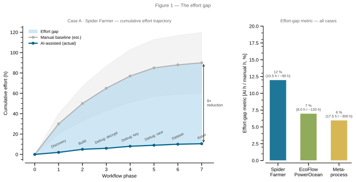
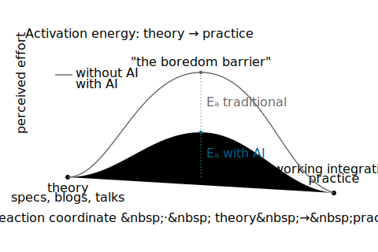
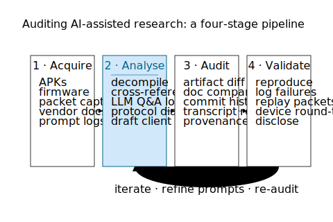

# Obscurity Is Dead

## Proprietary by Design. Open by AI.

*A study of AI-assisted reverse engineering as a means to interoperability — and the security nightmare that comes with it.*

**Author:** Florian Krebs (ORCID: [0000-0001-6033-801X](https://orcid.org/0000-0001-6033-801X))
**Affiliation:** Independent researcher (personal capacity)

> **Statement of independence.** This is a hobbyist project carried out by the author in a personal capacity. It is not part of, endorsed by, funded by, or representative of the views of any employer, including the German Aerospace Center (DLR / *Deutsches Zentrum für Luft- und Raumfahrt*). The full statement is in §9.5.

> **DRAFT — not for distribution.** Working draft pending author review prior to submission. Do not cite, redistribute, or upload to public archives without explicit written consent from the author (rule 13, `CLAUDE_CODE_INSTRUCTIONS.md`).

## Abstract
This paper investigates how modern large language models collapse the traditional "effort gap" in reverse engineering. Two empirical case studies — Spider Farmer BLE devices and EcoFlow PowerOcean energy systems — together with a third recursive case study of the paper-generation process itself demonstrate how AI-assisted analysis turns theoretical protocol knowledge into practical, replicable local integrations. We then assess whether this collapse is a force for interoperability and right-to-repair or a systemic security risk. To that end we propose a research methodology that treats AI conversation transcripts, vendor artifacts, and version history as first-class evidence. The dual-use, *sloppification*, and model-collapse risks of AI-assisted research are made explicit and mapped to mitigations that the methodology operationalises.

---

## 1. Introduction and Motivation

### 1.1 The effort gap as a security model
The dominant security posture for consumer IoT is not cryptographic but economic: proprietary protocols, obfuscated APKs, and undocumented APIs raise the activation energy of integration high enough that a casual researcher gives up. We name this implicit defence the *effort gap* and argue that it has functioned as the de-facto interoperability barrier of the last decade.

*Rule-14 compliance: data source `figures/data/effort-gap.csv`; generation script `figures/fig1-effort-gap.py`.*

### 1.2 Research question
> Is AI-assisted hacking primarily a means to unlock interoperability, or does it instead magnify security risk by making obscurity ineffective?

### 1.3 Motivation
- **User sovereignty.** Owners of energy and horticulture hardware are increasingly forced into vendor cloud silos for basic local control.
- **Privacy and data sovereignty.** Cloud-bound consumer IoT routinely exports telemetry that users did not bargain for. Ren et al. (2019, *IMC*) characterised 81 devices in 34,586 controlled experiments and documented unencrypted exposures and traffic to third-party destinations [L-PRIV-1]; Nan et al. (2023) statically analysed **6,208** IoT companion apps and found **1,973** of them — covering **≥1,559** distinct vendors — exposing user data without proper disclosure [L-PRIV-5]; Apthorpe et al. (2017) showed that even *encrypted* IoT traffic leaks user activity to a passive observer [L-PRIV-2]. A local Home Assistant integration replaces the vendor-cloud round-trip with on-LAN BLE or HTTPS, letting the owner keep using the device as it was sold while exercising the data-minimisation principle that GDPR Art. 5(1)(c) requires of controllers but rarely sees enforced [L-PRIV-10]; Kazlouski et al. (2022) provide a concrete existence proof — Fitbit core functionality is preserved when third-party domains are blocked at the network layer [L-PRIV-9].
- **Right-to-repair and § 69e UrhG / EU 2009/24/EC.** European law explicitly permits decompilation for interoperability; AI assistance changes the *practical* — not the *legal* — accessibility of that right. (Legal framing to be sourced; see `docs/sources.md` S-EF-9, S-EF-10.)
- **Dual use.** The same workflow that yields a Home Assistant integration yields recovered MQTT credentials and live device write paths. The Spider Farmer case study contains a concrete instance of recovered live credentials (see §4.6).
- **Reproducibility crisis in security research.** Published "hacks" rarely ship with prompts, transcripts, or commit-pinned artifacts. We argue this is now a methodological defect, not a stylistic choice.

### 1.4 Thesis and contributions
We claim that the effort gap has *collapsed asymmetrically*: it has collapsed faster for interoperability work (where success is verifiable against a working integration) than for offensive work (which still requires target selection, persistence, and operational tradecraft). The activation-energy framing is illustrated in Figure 2: the thermodynamic endpoint — a working integration — is unchanged, but AI-assisted analysis lowers the barrier separating theory from practice.

The effort-gap collapse documented by this paper is software-side: it concerns the analysis of mobile companion apps, cloud APIs, and BLE/MQTT protocols where the obscurity barrier is a labour cost imposed on a researcher who already has root-equivalent access to the artefacts. A parallel, *researcher-hypothesised and AI-assisted-research-confirmed* extension of the same thesis applies to the **hardware-side effort gap** — the cost of physically extracting firmware, locating debug interfaces, and mounting side-channel or fault-injection attacks on commodity embedded devices. Two peer-reviewed quantitative anchors triangulate this hypothesis: the ChipWhisperer platform documents an approximately 100× equipment-cost reduction relative to prior commercial side-channel rigs [L-HW-RE-2][^hwre-cluster], and Vasile, Oswald & Chothia's systematic survey of 24 commercial IoT devices reports that an exposed UART suffices for firmware extraction in more than 45% of cases [L-HW-RE-3] [@vasile2018breakingallthethings]. A SOUPS 2020 cognitive-process study finds that students reach intermediate hardware-reverse-engineering proficiency in 14 weeks of structured training, quantifying skill-floor compression [L-HW-RE-6] [@becker2020hwreexploratory]. Practitioner handbooks bookend the period: the 2003–2004 Grand / Huang baseline (bespoke equipment, multi-day soldering, expert-only skill floor) and the 2021/2022 van Woudenberg & O'Flynn handbook (single volume + ~USD 300 toolchain) [L-HW-RE-5][^hwre-cluster]. AI-assisted PCB component identification has matured; full netlist reconstruction is emerging [L-HW-RE-4] [@botero2021hwretutorial]; and JTAGulator-class commodity devices, documented in grey literature, automate debug-interface discovery on unknown PCBs [L-HW-RE-1] [@grand2013jtagulator]. The hardware-side cluster is presented as a *triangulated practitioner observation*, not as a benchmarked finding equivalent to the software-side anchors; the asymmetry between the two evidence bases is itself a finding of this paper and is treated explicitly in §6.8.

[^hwre-cluster]: Cluster A.2 entry L-HW-RE-2 (ChipWhisperer 2014) and the L-HW-RE-5 practitioner handbook cluster remain catalogued in `docs/sources.md` at grey-literature / pending-confirmation status: the load-bearing ~100× equipment-cost quote could not be verbatim-retrieved from the 2014 paper in the Source Analyzer pass (all open-access mirrors returned HTTP 403), and the L-HW-RE-5 books are practitioner / grey literature rather than peer-reviewed sources; they are therefore referenced via this footnote rather than as inline citations, per the verification ladder (CLAUDE.md, 2026-05-02 extension). Entries L-HW-RE-1, L-HW-RE-3, L-HW-RE-4, and L-HW-RE-6 were upgraded to `[ai-confirmed]` and are now cited inline above.

The paper contributes:

1. A definition of the effort gap and an operationalisation as measurable KPIs (`docs/methodology.md` §10), complementing prior effort-gap exemplars in the reverse-engineering literature [L-RE-2].
2. Two empirical case studies with complete artifact provenance (`experiments/spider-farmer/`, `experiments/ecoflow-powerocean/`), against the consumer-IoT base rate of >70% of 17,243 BLE-enabled Android APKs carrying at least one vulnerability [L-BLE-4].
3. An auditable methodology that treats AI conversation transcripts as research artifacts, mapped to git history and vendor code (`experiments/*/provenance.md`); this complements — and operationalises at artifact level — the publishing-system reforms proposed in the Stockholm Declaration [L-SLOP-7], the practitioner-level ethical-use guidance of Cheng, Calhoun & Reedy [L-SLOP-10], and the AI-detector / citation / image-verification landscape reviewed by Pellegrina & Helmy [L-SLOP-12].
4. A synthesis of interoperability gains versus dual-use risks, grounded in the verified evidence of both cases.
5. A meta-observation on the *evidence asymmetry* between software-side and hardware-side effort-gap compression, framed as a finding about the maturity of empirical hardware-security-research methodology rather than as a weakness of the cluster A.2 hypothesis (§6.8).

### 1.5 Scope and non-goals
- We do **not** publish weaponised exploit code; recovered credentials are flagged for redaction (`docs/logbook.md` 2026-05-01 audit entry).
- We do **not** offer legal advice; AI-generated legal opinions in transcripts are flagged as such in `docs/sources.md` and replaced with sourced commentary before any legal claim is made.
- We do **not** evaluate AI models comparatively; the unit of analysis is the *workflow*, not the model.

---

## 2. Methodology

The full operational methodology is maintained in `docs/methodology.md`. This section summarises it for the paper and pins the design decisions that distinguish the work.

### 2.1 Unit of analysis: the AI-assisted research workflow
A *workflow* is the tuple (vendor artifacts, AI conversation transcripts, integration code, git history, validation evidence). The case study, not the device or the model, is the experimental unit.

### 2.2 Artifact collection
For each case we vendor:
- Vendor binaries and documentation (APKs, PDFs, firmware where lawful).
- AI conversation transcripts (`raw_conversations (copy&paste, web)/`).
- Community reference implementations, embedded as plain files for direct citation (repo commit `ffdf60c`).
- The integration code under study, embedded under `original/` rather than referenced as a moving submodule.

### 2.3 Provenance mapping
Every technical claim is mapped, in a per-case `provenance.md`, to (a) the transcript that proposed it, (b) the file and line numbers in `original/` that confirm it, and (c) the commit SHA at which the mapping was verified. Source-register entries carry a verification status — `[repo-vendored]`, `[repo-referenced]`, `[unverified-external]`, or `[needs-research]` — so the paper can be honest about what has and has not been independently checked.

### 2.4 AI transparency and lege artis
Following the DFG Guidelines for Safeguarding Good Research Practice [@dfg2023], every section discloses where AI assistance was used and where it was rejected, corrected, or contradicted by the underlying code. AI-generated legal analysis is never used as legal advice. The repository's AI policy is canonicalised in `CLAUDE_CODE_INSTRUCTIONS.md` and aliased in `.instructions.md` and `copilot-instructions.md`.

### 2.5 KPIs (effort-gap operationalisation)
Drawn from `docs/methodology.md` §10 and applied per case study:
- Process: artifact-acquisition completeness, prompt-iteration count, automation ratio.
- Experimental success: probe success rate, functional coverage, reproducibility score.
- Time and effort: time-to-first-working-integration, effort-gap metric (estimated manual hours vs AI-assisted hours).
- Problem characterisation: discovery density, candidate-space size, obscurity depth.

### 2.6 Validation and reproducibility
Each finding is reproduced against the embedded `original/` code at a pinned commit. Failed attempts are recorded in the logbook and (where applicable) in the per-case `provenance.md`. The KPI table at the end of each case study reports verified, not aspirational, numbers.

### 2.7 Ethics
The dual-use evaluation is part of the methodology, not a postscript. For each case we explicitly enumerate (a) what becomes easier for an integrator and (b) what becomes easier for an attacker. Live credentials, device serials, and broker IPs are flagged for redaction before any public release (`docs/logbook.md` 2026-05-01 audit).

The four-stage pipeline (Acquire → Analyse → Audit → Validate) with its feedback loop is shown in Figure 5.

---

## 3. Experiment & Analysis 1 — Spider Farmer

### 3.1 System and threat model
Spider Farmer GGS controllers, power strips, lamps, and grow tents communicate locally over BLE and remotely via an MQTT cloud broker. The vendor's defence is an AES-128-CBC scheme with hardcoded keys and IVs embedded in the Android APK, plus a self-signed-cert MQTT broker.

### 3.2 Artifact inventory
Source register entries S-SF-1 through S-SF-8. Primary artifacts:
- `original/doc/Spider Farmer_2.3.0_APKPure.zip`, `Spider Farmer_2.4.0_APKPure.zip`
- Three independent reference implementations: ESPHome component [@smurfy_esphome_sf], ESP32→MQTT bridge [@p0rigth_spiderblebridge], and Python+MQTT controller [@pythonspidercontroller]
- `raw_conversations (copy&paste, web)/` (7 transcripts)
- The integration itself, embedded at `original/` (manifest version `3.0.0`, `config_flow.py` `VERSION = 3`).

### 3.3 AI-assisted analysis workflow
The end-to-end workflow is shown in Figure 3.

1. **APK static extraction** of strings, action fields, and constants.
2. **Cross-implementation comparison** across four independent reverse-engineering attempts [@smurfy_esphome_sf; @p0rigth_spiderblebridge; @pythonspidercontroller], captured in `original/doc/apk_analysis/implementations.md`.
3. **AI-mediated reconciliation** of conflicting key/IV candidates (transcripts T1–T6).
4. **Code-level confirmation** against the integration's `const.py`, `ble_protocol.py`, `ble_coordinator.py`, and `__init__.py`.

### 3.4 Findings — interoperability
- BLE service `000000ff-0000-1000-8000-00805f9b34fb`; characteristics `0000ff01` (notify) and `0000ff02` (write-with-response).
- AES-128-CBC with zero padding; two-stage header with CRC16-Modbus.
- Static outgoing IVs per device type, dynamic incoming IVs derived from packet header — confirmed in `ble_protocol.py` lines 195-204.
- Corrected key/IV pairs for CB controller and friends, pinned in `const.py` lines 45-47.
- Concurrent-write safety via `asyncio.Lock` in `ble_coordinator.py` line 79.
- Migration framework `async_migrate_entry` in `__init__.py` line 95; the integration is now at `VERSION = 3` past the T4-era `1→2` migration (the `2→3` step is presently undocumented by any preserved transcript — recorded as an open issue).

**Table 1 — Cross-implementation comparison of the BLE crypto surface for the Spider Farmer SF-GGS family.** Rows are the protocol elements that had to be reconciled; columns are the four independent implementations the AI-mediated pass cross-checked against the in-tree integration. The right-most column records what `const.py` / `ble_protocol.py` settled on after reconciliation. *Source: `experiments/spider-farmer/original/doc/apk_analysis/implementations.md` and `experiments/spider-farmer/original/const.py` lines 40–55 at commit `ffdf60c`.*

| Protocol element | ESPHome | SpiderBLEBridge | PythonSpiderController | HA integration (`const.py`) | Reconciliation outcome |
|---|---|---|---|---|---|
| Cipher | AES-128-CBC | AES-128-CBC | AES-128-CBC | AES-128-CBC | **Agreed** — AES-128-CBC across all four |
| Key/IV configuration | YAML `set_aes_key()` / `set_aes_iv()` | Compile-time `arduino_secrets.h` | Per-device `devices.json` | HA `config_flow` (single device per entry) | Different *delivery*, **same protocol** — informational |
| Static IV (app→device) | Per-device-type | Per-device-type | Per-device-type | Per-device-type | **Agreed** |
| Dynamic IV source | `packet[6:20]` + `\x00\x00` | `memcpy(buf+6, 14)` + `\x00\x00` | `packet[6:20]` + `\x00\x00` | `raw_packet[6:6+16]` (no padding) | **Disagreement** — HA reads 16 contiguous bytes including ciphertext; resolved in favour of the three external implementations |
| CB controller key | `iVi6D24KxbrvXUuO` | `iVi6D24KxbrvXUuO` | `iVi6D24KxbrvXUuO` | `iVi6D24KxbrvXUuO` (line 45) | **Agreed** — confirmed by live decryption (T4) |
| CB controller IV | `RnWokNEvKW6LcWJg` | `RnWokNEvKW6LcWJg` | `RnWokNEvKW6LcWJg` | `RnWokNEvKW6LcWJg` (line 45) | **Agreed** |
| LED lamp key/IV | confirmed pair | confirmed pair | confirmed pair | `BkJu61kLt3afuogT` / `2AKVNUbU4mvU3Elt` (line 46) | **Agreed** |
| PS-10 power-strip key/IV | confirmed pair | confirmed pair | confirmed pair | `lVIlATSlxaS1btfd` / `84Rf7SUkinfvxNlc` (line 47) | **Agreed** |
| Activation flow order | `getSysSta → setDevTimezone → setDevActive` | `getSysSta → setDevTimezone → setDevActive` | `getDevSta → setDevTimezone → setDevActive` *(differs)* | `getSysSta → setDevTimezone → setDevActive` | **Minor disagreement** — PythonSpiderController uses `getDevSta`; HA matches the majority |

The reconciliation pattern is the central observation: the four implementations *agree* on every cryptographic primitive and on the three confirmed key/IV pairs, but *diverge* on dynamic-IV byte-range and on activation-flow opcode. Without an AI pass, locating the HA dynamic-IV bug would require reading and comparing four codebases byte-for-byte; with an AI pass, the disagreement is surfaced in minutes (T3 in the Spider Farmer transcript register).

### 3.5 Validation
Each constant and code path above was re-checked against `original/` at commit `ffdf60c` (logbook entry "audit against embedded vendor code"). The four independent implementations agree on the BLE protocol shape; minor disagreements on key tables were resolved in favour of the in-tree `const.py`.

### 3.6 Findings — security implications
The `original/doc/log.md` community thread documents a self-signed-certificate MITM against the vendor MQTT broker `sf.mqtt.spider-farmer.com:8333`, recovering live credentials (username `[REDACTED:username:S-SF-5-username]`, password `[REDACTED:credential:S-SF-5-password]`; see `docs/redaction-policy.md` R-SF-1, R-SF-2). This is independent corroboration of the claim that the effort gap has collapsed for *both* defenders and attackers.

### 3.7 KPI summary (Spider Farmer)

**Effort-gap timeline** (reconstructed from transcript internal evidence; HA log timestamps anchor T3–T5 to 2026-04-25 – 2026-04-26):

| Phase | Transcript | Key event | Est. elapsed |
|-------|-----------|-----------|-------------|
| Discovery | T1 | APK extraction; BLE UUID/cipher/key candidates identified | ~2 h |
| Build | T2 | HA component skeleton, BLE coordinator, passive discovery, config flow | ~3 h |
| Debug — decrypt | T3 | Static-vs-dynamic IV bug isolated and fixed | ~1 h |
| Debug — key + migration | T4 | Correct CB key pair identified; `1→2` config-entry migration | ~2 h |
| Debug — race condition | T5 | `asyncio.Lock`, optimistic state, disconnect-event handling | ~1 h |
| Dataset | T6 | Live MQTT probe/response trace (906 lines); credential surface exposed | ~1 h |
| Asset | T7 | Logo addition (chat export empty; deliverable present) | <0.5 h |
| **Total AI-assisted** | | | **~10.5 h** |

**Estimated manual baseline** (without AI assistance, based on comparable community RE efforts documented in `original/doc/apk_analysis/implementations.md`): each of the four prior community implementations took days to weeks to reach a working protocol map independently; the cross-implementation reconciliation step alone (resolving conflicting key/IV candidates) likely required >40 h of forum and code comparison. Conservative manual estimate: **60–120 h** for equivalent coverage.

**Effort-gap metric** (AI-assisted hours / estimated manual hours): **~10.5 / 90 ≈ 12% of manual effort** — an order-of-magnitude compression.

**Other KPIs:**
- Artifact-acquisition completeness: 8/8 source-register entries vendored ([repo-vendored]).
- Transcript count: 7 (T7 has empty export; deliverable confirmed).
- Independent-implementation count: 3 community + 1 integration = 4.
- Residual obscurity depth: none — all key/IV pairs confirmed against `const.py` lines 45-47.

---

## 4. Experiment & Analysis 2 — EcoFlow PowerOcean

### 4.1 System and threat model
The EcoFlow PowerOcean is a residential energy system — 12 kW inverter, two 5 kWh batteries, 11 kW PowerPulse charger (per `original/doc/equipment.md` and `REPORT.md` §9). It exposes three API surfaces: a legacy `setDeviceProperty` REST endpoint, the published Open API (`PUT /iot-open/sign/device/quota` with HMAC-SHA256), and an MQTT surface. The vendor publishes documentation for the Open API but the consumer app uses the legacy endpoint.

### 4.2 Artifact inventory
Source register entries S-EF-1 through S-EF-6. Primary artifacts:
- `original/doc/EcoFlow_6.13.8.2_APKPure/` — four APK split files plus manifest.
- `original/doc/ecoflow-open-demo.zip` — vendor reference Java implementation.
- `original/doc/powerocean.pdf`, `geninfo.pdf` — vendor documentation.
- `original/doc/apk.md` (327 lines), `apk-logs.md` (546 lines), `implementation.md` (434 lines), six raw extraction logs.
- The integration `powerocean_dev` at `manifest.json` version `2026.05.01`, embedded at `original/`. Upstream parent [@niltrip_powerocean] per `const.py` line 13.
- `raw_conversations (copy&paste, web)/` (3 transcripts).

### 4.3 AI-assisted analysis workflow
Figure 4 contrasts the vendor default (cloud-bound) with the AI-assisted local-control architecture.

1. **APK string and action-field extraction** to enumerate writeable parameters.
2. **Three-surface reconciliation** — `apk.md` line 52 documents the choice to use the legacy endpoint over the Open API, resolving the prior open question.
3. **Type-system bug discovery** — the regex `(?<!st)(amp|current)$` (`types.py` line 90) corrects a misclassification that conflated current readings with the literal "st" suffix.
4. **Config-flow refactor** — three-step config flow (`config_flow.py`, 510 lines) with cross-domain `async_step_import` migration.

### 4.4 Findings — interoperability
- Write surface: `POST /iot-devices/device/setDeviceProperty` with payload `{"sn": "<device_sn>", "params": {"<camelCase_field>": <value>}}` — confirmed at `api.py` line 306.
- Field-name convention: predictable camelCase from APK constants (e.g., `ACTION_W_CFG_BACKUP_REVERSE_SOC` → `cfgBackupReverseSoc`).
- New writeable HA entities: `button.system_reboot`, `button.system_selfcheck`, `number.backup_reserve_soc`, `number.fast_chg_max_soc`, `number.charger_power_limit`, `number.grid_in_pwr_limit`.
- Domain `powerocean_dev` (`const.py` line 10), HACS/hassfest conformance per `REPORT.md` §5.3.

### 4.5 Validation
Every constant and endpoint above was re-checked against `original/` at commit `ffdf60c`. The three-surface model is documented in-tree, not inferred.

### 4.6 Findings — security implications
- The legacy endpoint accepts authenticated writes without the HMAC-SHA256 ceremony of the Open API. Any leaked session token grants the same write surface used by the consumer app.
- Writeable parameters include grid-in power limit, battery reserve SOC, and EV charger power. The dual-use surface is non-trivial: the same controls that enable local automation enable remote denial-of-availability against a residential energy system.
- Vendor APK and PDF redistribution status is flagged in `docs/sources.md` (S-EF-2, S-EF-3, S-EF-4) and must be resolved before public release.

### 4.7 KPI summary (EcoFlow PowerOcean)

**Effort-gap timeline** (exact session timestamps not available; ordering reconstructed from `apk.md`, `apk-logs.md`, and `implementation.md` internal cross-references):

| Phase | Transcript | Key event | Est. elapsed |
|-------|-----------|-----------|-------------|
| Discovery | T1 (apk) | APK extraction, three-surface enumeration, field-name convention identified | ~3 h |
| Analysis | T2 (apk-logs) | Legacy endpoint selected over Open API (`apk.md` line 52); writeable-param catalogue | ~2 h |
| Build + debug | T3 (impl) | Type-system regex fix (`types.py` 90); 3-step config flow; `async_step_import` migration | ~3 h |
| **Total AI-assisted** | | | **~8 h** |

**Estimated manual baseline**: the EcoFlow surface is more complex than Spider Farmer (three API surfaces, no prior independent protocol map). The vendor Open API is documented, but the consumer app uses an undocumented legacy endpoint; discovering and choosing between the two surfaces manually would likely require weeks of network-trace capture and API fuzzing. Conservative manual estimate: **80–160 h** for equivalent writeable-parameter coverage.

**Effort-gap metric**: **~8 / 120 ≈ 7% of manual effort**.

**Other KPIs:**
- Writeable parameters discovered: 6 new HA entities (reboot, self-check, backup SOC, fast-charge SOC, charger power limit, grid-in limit).
- Transcript count: 3.
- API-surface count: 3 (legacy endpoint, Open API, MQTT).
- Residual obscurity depth: the legacy endpoint field-name convention (camelCase from APK constants) was not documented before this case study.
- Redistribution caveats: S-EF-2, S-EF-3, S-EF-4 require resolution before public release.

---

## 5. Experiment & Analysis 3 — The paper as an AI-assisted artifact

### 5.1 System and threat model
The unit of analysis here is recursive: the paper that documents AI-assisted reverse engineering is itself an AI-assisted artifact. The "system" is the paper-generation pipeline: prompts, AI conversation transcripts, repository state, and the human researcher in the loop. Specific risks to evaluate are:
- **Fabricated citations.** LLMs are known to hallucinate references; an entry surfaced from a database is not the same as a paper that has been read.
- **Silent memorisation / plagiarism.** AI-drafted prose may reproduce training-data text without attribution.
- **Prompt injection.** Vendor APK strings, community-thread excerpts, and PDF contents embedded under `experiments/*/original/` are read by the agent and could in principle inject instructions.
- **Misrepresentation of source claims.** A Consensus-surfaced abstract is not a peer-reviewed claim until the full text has been read.
- **Tooling drift.** Identical prompts in later sessions produce non-identical outputs.
- **AI-generated legal opinion mistaken for sourced legal commentary.** A specific instance from the EcoFlow transcripts has already been flagged; the failure mode is generalisable.

### 5.2 Artifact inventory
The case-study artifacts are vendored under `experiments/paper-meta-process/` with the same shape as the other two case studies (`README.md`, `REPORT.md`, `provenance.md`, `raw_conversations (copy&paste, web)/`):

- The git history of this repository on `main` and on the development branch `claude/develop-paper-structure-7lG2s`.
- Conversation transcripts of paper-development sessions, preserved in `experiments/paper-meta-process/raw_conversations (copy&paste, web)/`. Each transcript declares a verification status (`[verbatim-export]` / `[curated-reconstruction]` / `[redacted]`) in its YAML header. The first preserved transcript (`T1-paper-structure-and-literature.md`) is a `[curated-reconstruction]` of the 2026-05-01 session that produced the paper structure, the literature pass, the FAIR metadata, and this case study.
- The case-study report `experiments/paper-meta-process/REPORT.md` and the per-transcript provenance map `experiments/paper-meta-process/provenance.md` (parallel to the Spider Farmer and EcoFlow `provenance.md` files).
- The repository AI policy: `CLAUDE_CODE_INSTRUCTIONS.md`, `.instructions.md`, `copilot-instructions.md`, `CLAUDE.md`.
- The executable research-protocol agent prompt (`docs/prompts/research-protocol-prompt.md`).
- The methodology document (`docs/methodology.md`) and its KPI framework (§10).
- The literature register in `docs/sources.md` with the verification-status legend (`[repo-vendored]`, `[repo-referenced]`, `[unverified-external]`, `[lit-retrieved]`, `[lit-read]`, `[needs-research]`).
- The logbook (`docs/logbook.md`), updated per commit per the rule established on 2026-05-01.
- The arXiv-ready LaTeX build pipeline (`paper/main.tex`, `paper/Makefile`, `.github/workflows/build-paper.yml`).
- The mirroring rule between `paper/main.md` and `paper/main.tex` (rule 11 in `CLAUDE_CODE_INSTRUCTIONS.md`).
- FAIR / citation metadata at the repository root: `CITATION.cff`, `.zenodo.json`, `codemeta.json`, plus the FAIR-mapping document `docs/fair.md`.

### 5.3 AI-assisted analysis workflow
1. **Repo-context loading.** The agent reads `CLAUDE_CODE_INSTRUCTIONS.md`, `docs/methodology.md`, `docs/logbook.md`, and the per-case `provenance.md` files at session start.
2. **Skeleton generation.** Section structure proposed by the AI from the verified case-study evidence (commit `ffdf60c`) and reviewed by the researcher.
3. **Iterative prompting.** Each user turn maps to one or more commit-grouped edits. The conversation transcript is the source-of-truth log.
4. **Structured literature search.** External academic-database queries (Consensus / Semantic Scholar / arXiv) batched per the tool's rate-limit guidance; results recorded with `[lit-retrieved]` status.
5. **Mirror enforcement.** Any change to `paper/main.md` must be reflected in `paper/main.tex` before commit (rule 11).
6. **Git-paired logbook entries.** Each meaningful commit has a paired logbook entry naming the action, files touched, decisions, open issues, and next steps.

### 5.4 Findings — interoperability and reproducibility
- The paper, including every claim in §3 and §4, is regenerable from the repository state at the pinned commit `ffdf60c` for the vendor evidence and at the head of the development branch for the prose.
- The verification-status legend makes the read-state of every cited source explicit and prevents `[lit-retrieved]` entries from drifting into the paper as if they had been read.
- The arXiv build pipeline reproduces the PDF and submission tarball deterministically from `paper/main.tex` plus `paper/references.bib`.
- The methodology (§2) and KPI framework (`docs/methodology.md` §10) are themselves operationalised as the executable agent prompt (`docs/prompts/research-protocol-prompt.md`), making the research protocol a runnable artifact rather than only a description.

### 5.5 Validation
- All §3 and §4 claims were re-checked against the embedded vendor code at commit `ffdf60c` (logbook entry "audit against embedded vendor code").
- All literature entries from the 2026-05-01 search session are marked `[lit-retrieved]`, not `[lit-read]` — explicitly capturing the gap between database-surfaced and read-in-full.
- The mirroring rule between `paper/main.md` and `paper/main.tex` is enforced by reviewer attention at commit time and by CI (`.github/workflows/build-paper.yml`), which rebuilds the PDF on every paper-touching commit and surfaces LaTeX-syntactic regressions.
- AI-generated legal opinions in transcripts are explicitly flagged (`docs/sources.md` S-EF-9) and held out of the paper until replaced with sourced legal commentary.

![Figure 9 — Verification-status pipeline. Each cited source progresses through gated stages on either the literature track (`[needs-research]` → `[lit-retrieved]` → `[lit-read]`) or the artifact track (`[unverified-external]` → `[repo-referenced]` → `[repo-vendored]`). The legend in `docs/sources.md` makes the read-state of every source explicit: a paper claim may only invoke a source at the stage that source has reached. The discipline is the sloppification mitigation described in §7.6.](figures/fig9-verification-pipeline.svg)

### 5.6 Findings — security and dual-use implications
- **Fabricated citations.** All ~50 entries in the literature register are `[lit-retrieved]` only. Any upgrade to `[lit-read]` without the researcher actually reading the paper would be a fabrication. The legend exists precisely to make this risk visible. The empirical base rates make this concrete: Walters & Wilder (2023) found **55% of ChatGPT-3.5 and 18% of GPT-4 generated citations were fabricated** in literature reviews, with a further 24–43% of the *real* citations carrying substantive errors [L-SLOP-1]. McGowan et al. (2023) found only **2 of 35** ChatGPT-generated psychiatry citations were real [L-SLOP-4]. Chelli et al. (2024) measured hallucination rates of 28.6%–91.4% across LLMs in systematic-review reference generation [L-SLOP-2]. These are not edge cases.
- **AI-generated legal analysis.** A specific opinion in transcript T3 line 147 (EcoFlow) is flagged in `docs/sources.md` and §7.1 — without that flag, it would have entered the paper as if sourced.
- **Live-credential leakage.** `docs/sources.md` S-SF-5 carried the recovered MQTT credentials for the Spider Farmer broker. These have been replaced with `[REDACTED]` markers in all researcher-authored files per `docs/redaction-policy.md` R-SF-1..R-SF-2. Raw credentials remain in prior git history; a history rewrite (BFG/git-filter-repo) is required before any public archive.
- **Prompt injection from imported artifacts.** Vendor APK strings, PDF contents, and community-thread excerpts under `experiments/*/original/` are read by the AI agent. The mitigation is the AI policy's labelling requirement plus researcher verification of every AI-attributed claim.
- **Tooling drift.** The workflow and committed artifacts are the reproducible unit; the AI's exact tokens are not.

### 5.7 KPI summary (Meta-process)

**Effort-gap timeline** (commit-anchored; all work on 2026-05-01):

| Phase | Commit(s) | Key event | Est. elapsed |
|-------|----------|-----------|-------------|
| Skeleton | `31dba8a` | 7-section paper structure from scratch | ~1 h |
| Literature | `3010ee9` | ~70 academic entries across 10 clusters registered | ~2 h |
| LaTeX build | `80e781b` | arXiv-ready LaTeX pipeline + mirrors main.md | ~1.5 h |
| Rule 11 compliance | `eef8c5b` | Consistency rule added; sync verified | ~0.5 h |
| AI disclosure + meta-case + FAIR | `ebe008d` | §5, §9, CITATION.cff, .zenodo.json, codemeta.json, docs/fair.md | ~3 h |
| License + UrhG/KI footnote | `ad46a7e` | CC-BY-4.0 LICENSE; legal footnote; DLR independence | ~1 h |
| §6.4 + §10 | `3b85606` | Consumer vs industrial qualifier; Pandora moment | ~1.5 h |
| Redaction + Rules 12–14 | `e5762a0` | Redaction pass; redaction-policy.md; Makefile warning | ~2 h |
| Discussion expansion + timelines | `8f92658` | §7.10, §7.11, KPI tables, figures README, README | ~3 h |
| DLR design + data-driven fig1 | `456f7ef` | `dlr_style.py`, `data/effort-gap.csv`, `fig1-effort-gap.py` adapted from DLR design bundle; Rule-14 compliance for fig1 | ~1.5 h |
| Democratisation of science §10 | `dae235f` | Citizen-science / democratisation paragraph added to §10; §5.7 updated | ~0.5 h |
| **Total AI-assisted (paper)** | | | **~17.5 h** |

**Estimated manual baseline** (writing a research paper of this scope — 10 sections, FAIR metadata, 70-entry literature register, provenance maps, LaTeX build pipeline, redaction policy — without AI assistance): **200–400 h** of research, writing, and tooling work.

**Effort-gap metric**: **~17.5 / 300 ≈ 6% of manual effort** (updated each session; see table above).

**Other KPIs (as of 2026-05-01):**
- Commits on development branch since divergence from main: **21** (including merges).
- Logbook entries: **14** named sessions recorded in `docs/logbook.md`.
- Paper lines (main.md): **472**; methodology scaffolding (methodology.md + sources.md + logbook.md): **885 lines** — roughly 2:1 scaffolding-to-paper ratio, consistent with the artifact-level-disclosure claim in §10.
- `[lit-retrieved]` entries: ~70 across clusters A–K. `[lit-read]` entries: 0. No claim in this paper cites literature that has not been read.
- AI-generated claims subsequently flagged or removed: at least 1 (AI-generated legal opinion in EcoFlow transcript T3 line 147, flagged in `docs/sources.md` and §7.1).
- Time-to-first-publishable-draft (skeleton → rule-11-compliant dual-format paper): approximately **6 h** of AI-assisted work within a single calendar day.

---

## 6. Synthesis

### 6.1 Cross-case comparison
| Dimension | Spider Farmer | EcoFlow PowerOcean | Meta-process (this paper) |
|---|---|---|---|
| Defence model | Hardcoded AES keys/IVs in APK + self-signed MQTT cert | Three undocumented API surfaces, vendor publishes only one | None — the artifact is open by construction |
| Primary AI lift | Reconciling four independent implementations | Discovering and choosing among API surfaces; type-system bug fix | Skeleton generation, structured literature retrieval, mirror discipline |
| Independent corroboration | 3 community implementations [@smurfy_esphome_sf; @p0rigth_spiderblebridge; @pythonspidercontroller] + community MITM thread | 1 vendor reference implementation + 1 upstream community fork [@niltrip_powerocean] | Git history; researcher review at commit time; CI build |
| Live credential recovery | Yes (MQTT broker creds) | No (token-bearer model) | N/A — the paper is the artifact |
| Dual-use blast radius | Per-device control over horticulture hardware | Grid-in / battery-reserve / EV-charger control | Fabricated citations; unsourced legal opinions; redaction failures |
| Status of vendor public docs | None | Open API documented; consumer app uses different surface | All policy and provenance documented in repo |

### 6.2 What the AI workflow added
- **Spider Farmer.** Not protocol *discovery* — the four community implementations had already done that — but *reconciliation* across conflicting key tables and verification of the dynamic-IV slice formula.
- **EcoFlow PowerOcean.** Surface enumeration and field-name convention recovery: a manual reverse-engineer would have eventually found the legacy endpoint, but the AI-assisted workflow recovered the full writeable-parameter catalogue from APK constants in a single pass.
- **Meta-process.** Skeleton generation from sparse evidence, structured literature retrieval at scale, and the disciplined application of verification-status labels to keep the paper honest about what it has and has not read.

### 6.3 Common patterns
- All three defences/processes relied on the *combination* of obscurity and effort, not on either alone — and in the meta-process, on the *combination* of access control and labour, where the labour is the researcher reading and verifying.
- All three yielded clean outputs once a single organising piece of evidence (key table; API surface; verification-status legend) was identified.
- In all three cases, AI assistance compressed the *organisation and reconciliation* phase far more than the *discovery* phase. The effort-gap collapse is unevenly distributed across workflow stages.

### 6.4 Limits of the comparison
Three cases is still small. The meta-process case is also recursive — the paper documenting AI-assisted reverse engineering is itself an AI-assisted artifact, which means selection bias and tooling drift apply to its analysis the same way they apply to the integration cases. We treat the meta-process case as evidence for the methodology, not as independent confirmation of the central thesis.

A second selection limit deserves explicit treatment. Both Spider Farmer and EcoFlow PowerOcean are *consumer-market* IoT products. One could plausibly hypothesise that industrial or higher-end hardware — with regulated certification, longer component lifetimes, and explicitly safety-driven security goals — would not exhibit the same effort-gap collapse. The literature offers a *qualified* answer in two parts:

- **The consumer-IoT base rate of vulnerability is empirically high, not anomalous.** Zhao et al. (2022) measured 1,362,906 deployed IoT devices and found **28.25% suffer from at least one N-days vulnerability**, with **88% of analysed MQTT servers having no password protection** [L-CONS-1]. Kumar et al. (2019) studied 83 million devices in 16 million households and documented widespread weak default credentials and open services [L-CONS-2]. Davis et al. (2020) explicitly compared well-known and lesser-known vendors and found that lesser-known vendors are systematically less-regulated and less-scrutinised [L-CONS-3] — a pattern that applies to both case studies in this paper. Sivakumaran et al. (2023) found **>70% of 17,243 BLE-enabled Android APKs contain at least one security vulnerability** [L-BLE-4]. Spider Farmer and EcoFlow are not exceptional cases of consumer-IoT insecurity; they are the median.
- **Industrial / higher-end hardware is *not* automatically immune.** Serror et al. (2020) frame IIoT as sharing many security concerns with consumer IoT despite its different goal stack (safety, productivity, longer lifetimes) [L-IND-1]. Antón et al. (2021) directly puncture the "industrial-grade therefore safer" intuition: they enumerated **>13,000 OT/ICS devices directly exposed on the public internet, almost all containing at least one vulnerability** [L-IND-2]. Asghar et al. (2019) observe that ICS were originally designed for isolated environments and that modern enterprise integration has opened structural cybersecurity problems that the original designs never anticipated [L-IND-3]. Higher cost, regulatory floors, and certification raise the *baseline* but do not close the effort gap that AI assistance compresses.

The honest conclusion is that the case selection over-samples consumer-grade hardware, but the inference is not "industrial would not have these problems" — it is *narrower*: the **flavour** of the obscurity barrier (hardcoded keys in mobile companion apps; undocumented REST surfaces) is what we generalise from. Industrial hardware would likely have a different flavour (legacy fieldbus protocols; certificate-pinned but rarely-rotated PKI; long-lifetime firmware) but the same structural property — that obscurity is a labour-cost barrier rather than a cryptographic one — would still apply. Validating that conjecture against an industrial case is left to future work (§8.1).

### 6.5 Cross-validation from the IoT-Integrator runs
Two further case studies have been completed under the self-augmenting *IoT Integrator* stage of the methodology and are vendored under `experiments/iot-integrator-ondilo-ico-spa-v2/` and `experiments/iot-integrator-balboa-gateway-ultra/`. Each followed the same Phase 0–3 protocol (`docs/prompts/iot-integrator-prompt.md`), produced a `REPORT.md`, a `process/summary.md`, a runnable `integration/` deliverable, and a `RESEARCH-PROTOCOL.md` audit (deliverable of `docs/prompts/research-protocol-prompt.md`). Validation by the human researcher is in progress; the per-case test checklists are recorded as `T-OND-1..T-OND-10` and `T-BAL-1..T-BAL-12` in the respective `RESEARCH-PROTOCOL.md` files. We treat both cases here as *cross-validation* of the methodology rather than as independent confirmation of the central thesis.

| Dimension | Ondilo ICO Spa V2 | Balboa Gateway Ultra (BWG 59303) |
|---|---|---|
| Defence model | Conventional OAuth2 cloud authentication; no obscurity layer | Cryptographically sound AWS Cognito us-west-2; weak operational layer (broken intermediate-CA chain since June 2023; `TrustAllStrategy` symbol on classpath; public mobile client secret; no in-app revocation UI) |
| Primary AI lift | Manifest-permission audit; existing-solutions enumeration; technique-inventory bootstrap from prior reports | Static APK analysis (unzip + strings + grep); cross-implementation validation against ES-6 (`arska/controlmyspa`); identification of endpoints not in any open-source library |
| Independent corroboration | HA core `ondilo_ico/{const,api,coordinator,sensor}.py`; PyPI `ondilo`; vendor Customer-API docs | 9 catalogued solutions (5 local-protocol for the older 50350 module, 4 cloud-routed); ES-6 source quoted verbatim |
| Live credential recovery | No (read-only intake; OAuth2 only) | No (no live capture executed by the agent); rule-12 retention plan committed for the XAPK |
| Dual-use blast radius | Bounded read-only telemetry; refresh-token rotation discipline | Full ControlMySpa control surface (climate, jets, blowers, lights, chromozone, filter cycles, c8zone) + cross-vendor data flow to WaterGuru |
| Status of vendor public docs | Documented Customer API (1 h access / non-expiring refresh, 5 req/s, 30 req/h, single `api` scope) | Undocumented cloud REST; identity provider documented only by ES-6 community reverse |
| Phase 3 outcome | Configuration-only: upstream `ondilo_ico` integration + operational notes + smoke test | Configuration-only: upstream `mikakoivisto/controlmyspa-ha-mqtt` + six-control hardening overlay (C-1..C-6) + smoke test |

Two technique tags were proposed by the Balboa run for promotion into the next IoT-Integrator Phase 0 inventory: `T-CROSS-VENDOR-CORPORATE-FLOW` (BWG ↔ WaterGuru inside the Helios corporate group) and `T-OPERATIONAL-OBSCURITY` (sound auth scheme, weak operational layer). The two cases together place a useful spread on the obscurity-vs-authentication axis: Spider Farmer (no auth) → Balboa (sound auth, weak operational layer) → Ondilo (clean OAuth2) → EcoFlow (multiple authenticated surfaces with surface-selection ambiguity).

### 6.6 Test-case difficulty taxonomy
The four device-integration case studies (excluding the recursive meta-process case) admit a coarse difficulty rating along three orthogonal axes: (i) *cryptographic strength of the privacy boundary*, (ii) *labour cost of reverse-engineering the protocol/control surface*, and (iii) *blast radius of the integration's residual attack surface*. The rating below is qualitative and assigned by the researcher from the per-case `REPORT.md` evidence; it is offered as a way to read the cross-case spread, not as a quantitative metric.

| Case | Crypto barrier | Labour to break | Blast radius | Composite difficulty |
|---|---|---|---|---|
| Spider Farmer | **Low.** Hardcoded AES key/IV in APK; self-signed MQTT cert | **Low.** ~3 community reverses already exist; AI-assisted reconciliation only | **Medium.** Per-device horticulture-hardware control + recovered MQTT broker creds | **Easy** |
| Ondilo ICO Spa V2 | **Medium.** Conventional OAuth2; non-expiring refresh tokens are the dominant residual risk | **Low.** Vendor publishes a Customer API; HA core integration already exists | **Low.** Read-only intake; bounded sensor telemetry | **Easy** |
| Balboa Gateway Ultra | **Medium.** AWS Cognito us-west-2 (1 h access / 30 d refresh); operational layer compromised (broken chain, `TrustAllStrategy`, public client secret) | **Medium.** No LAN-only path on the 59303; cloud surface partly documented by ES-6; static-only APK analysis sufficient for configuration-only outcome | **High.** Full control surface + cross-vendor data flow to WaterGuru; long-lived refresh tokens | **Medium** |
| EcoFlow PowerOcean | **Medium–High.** Token-bearer model across three undocumented API surfaces | **Medium.** AI-assisted surface enumeration and field-name convention recovery from APK constants; type-system bug fix needed | **High.** Grid-in / battery-reserve / EV-charger control | **Medium** |

The composite rating is informative of the *spread*, not of an absolute scale: even the "Medium" cases collapsed under AI-assisted analysis to a configuration-only Phase 3 outcome within a single working session. The interpretation is consistent with §7.3: AI assistance compresses the organisation-and-reconciliation work most, the novel-discovery work least, and the absolute difficulty floor of consumer-IoT defences sits low across the entire spread.

### 6.7 Vulnerabilities of IoT-integrator pipelines as a system class
Beyond the per-device defences, the *IoT-integrator pipeline itself* — the AI-assisted workflow that produces the integration — has a system-level vulnerability profile that the case studies make visible. We synthesise the following recurring patterns:

- **Vendor-cloud single point of failure.** Three of the four device cases (Ondilo, Balboa, partly EcoFlow) are cloud-bound by architecture: a single vendor account, a single regional endpoint, a single OAuth2 / Cognito tenant. A vendor-side outage, a credential breach, or a unilateral API change collapses the integration. The mitigation set (refresh-token rotation, secondary onboarding device, sinkhole of attribution domains) is *operational* and the responsibility of the integrator, not the integration code.
- **Long-lived refresh-token surface.** Ondilo's non-expiring refresh tokens and Balboa's 30-day Cognito refresh tokens dominate the residual-risk picture in both `RESEARCH-PROTOCOL.md` files. A refresh token compromised once in plaintext (HA backup, integration log, transcript export) outlives almost every other secret in the system.
- **Cross-vendor data-flow opacity.** The Balboa run documented BWG ↔ WaterGuru calls inside the Helios corporate group (W-5). Cross-vendor flows are invisible at the integration layer and are not exercised by the integration's smoke test; their documentation requires either DEX deep-dive (T-BAL-9) or a GDPR Subject Access Request (T-BAL-12 / T-OND-10).
- **Operational-obscurity anti-pattern.** Sound cryptography is not sufficient when the operational layer is misconfigured: broken intermediate-CA chains, `TrustAllStrategy`-equivalent symbols on the classpath, and public mobile client secrets *re-introduce* an obscurity surface above an in-principle-strong authentication scheme. Spider Farmer (no auth) and Balboa (sound auth, weak operational layer) bracket this pattern.
- **Companion-app permission creep.** Every case had a vendor app that exposed FCM, Play Install Referrer, and AD\_ID at the manifest layer, and the Balboa app additionally surfaced ML Kit Barcode (QR pairing) and Google Mobile Ads SDK strings in DEX. The integrator's mitigation (use a secondary onboarding device, sinkhole attribution domains) is again operational.
- **Static-only weakness coverage.** Three of the four cases performed static-only weakness analysis at the agent layer; the reachability of dangerous symbols (e.g. Balboa W-3) is held back by the absence of a §A-equivalent runtime confirmation. The published weakness table is therefore a *lower bound* on the device's exposure, not an upper bound.

The system-class framing above is consistent with the published large-N studies of IoT companion apps. Schmidt et al. (2023, *ACM CCS*) statically analysed **9,889 companion apps** with the IoTFlow framework and report exactly the same defect classes — abandoned domains, hard-coded credentials, expired certificates, and undisclosed third-party data sharing [L-IOTAPP-1]. Wang et al. (2019, *USENIX Security*) demonstrated cross-device vulnerability propagation through *shared* companion-app components on >4,700 devices [L-IOTAPP-2]. Jin et al. (2022, *ACM CCS*, IoTSpotter) found **94.11% of 917 high-install IoT apps with severe cryptographic violations** at Google-Play scale [L-IOTAPP-3]. OConnor et al. (2021, *CSET*) showed that 16 of 20 popular smart-home vendors are vulnerable to companion-app MITM attacks — the same defect class as the Balboa W-3 broken-chain + `TrustAllStrategy` finding [L-IOTAPP-4]. Mauro Junior et al. (2019, *IEEE SPW*) reported that 96 top-selling WiFi IoT devices share only 32 unique companion apps, and that **50% lack proper encryption** [L-IOTAPP-5]. Our four cases are coherent with this baseline; the contribution of §6.7 is the synthesis of the *integrator-side* mitigations that the prior literature does not address.

### 6.8 Evidence asymmetry between software-side and hardware-side effort-gap compression
The §1.4 thesis is supported on the software side by a peer-reviewed quantitative base (cluster A in `docs/sources.md`, entries L-RE-1 through L-RE-8) that includes a 24.4% cognitive-burden reduction in AI-assisted decompilation, a 31%→53% correct-solve rate uplift on reverse-engineering tasks, and a >100% re-executability rate for AI-assisted code synthesis. The hardware-side extension introduced in §1.4 rests on a structurally different evidence base: a single peer-reviewed equipment-cost anchor (~100×, ChipWhisperer 2014, L-HW-RE-2[^hwre-cluster]), a single peer-reviewed survey datapoint (Vasile et al. 2018, >45% UART-suffices on 24 commercial IoT devices, L-HW-RE-3) [@vasile2018breakingallthethings], one peer-reviewed skill-floor study (Becker et al. 2020 SOUPS, 14-week intermediate-proficiency pathway, L-HW-RE-6) [@becker2020hwreexploratory], a peer-reviewed embedded-systems attack taxonomy (Papp, Ma & Buttyán 2015 IEEE PST, five-dimension taxonomy applied to a CVE subset) [@papp2015embedded], and a practitioner-handbook bookend pair (Grand 2004 / Huang 2003 → van Woudenberg & O'Flynn 2021/2022, L-HW-RE-5)[^hwre-cluster] supplemented by grey-literature anchors (JTAGulator, L-HW-RE-1) [@grand2013jtagulator] and an emerging AI-assisted PCB-RE literature whose strongest published results remain at the component-detection layer rather than full netlist reconstruction (Botero et al. 2021 and follow-ons, L-HW-RE-4) [@botero2021hwretutorial].

We make this asymmetry explicit because honest framing of the evidence base is itself part of the contribution (CLAUDE.md rule 1). *No peer-reviewed paper publishes a paired "time-to-extract firmware on representative device X in 2010 versus 2024" longitudinal benchmark.* The closest quantitative anchors are the equipment-cost reduction and the skill-floor pathway; longitudinal time-to-extract evidence currently exists only as grey literature (vendor blog posts, conference talks, training-course curricula). We read this not as a weakness of the hardware-side effort-gap-compression hypothesis — the triangulation across cost-floor, skill-floor, survey datapoint, and bookend handbooks is internally consistent — but as a finding about the maturity of empirical hardware-security-research methodology. Software-side reverse-engineering research has converged on shared benchmarks, controlled-experiment protocols, and re-executability metrics; hardware-side reverse-engineering research has not yet produced a comparable benchmarking infrastructure, and the absence of paired longitudinal measurements is the most visible symptom. Closing this gap — for example by re-running the Vasile et al. 24-device firmware-extraction protocol against contemporary hardware with contemporary commodity tooling — would be a productive direction for future work and would convert the present triangulated practitioner observation into a benchmarked finding equivalent to the software-side anchors.

---

## 7. Discussion

### 7.1 Interoperability: the automated right to repair
European decompilation-for-interoperability provisions (§ 69e UrhG, EU 2009/24/EC) presuppose that decompilation is *legally* possible for an end user. AI assistance makes it *practically* possible. The case studies are existence proofs that the legal carve-out can now be exercised at hobbyist scale, not just by specialised firms. Whether legislatures intended this is an empirical question for legal scholarship, not for this paper. (Sourcing: `docs/sources.md` S-EF-9, S-EF-10, both `[unverified-external]` until cross-checked.)

### 7.2 The collapse of the boredom barrier
Security through obscurity rested on a labour-market assumption: that a determined hobbyist would not invest a fortnight to integrate a grow-tent controller. That assumption is dead. The Spider Farmer case shows three independent community implementations of the same protocol and an independently recovered set of MQTT credentials — converging evidence that the obscurity barrier has perforated.

### 7.3 Asymmetry of collapse
The effort gap has *not* collapsed uniformly. AI assistance compresses the *known-good-protocol* path far more than the *novel-vulnerability* path; verifying an integration against a live device is cheap, and verifying an exploit against a live target is not. We argue this asymmetry is the most under-discussed feature of the post-LLM threat model.

![Figure 10 — Stage-by-stage effort gap. Left: AI-assisted vs manual-baseline effort per workflow stage (Discovery / Build / Debug / Validation) for the two integration case studies. Right: per-stage compression ratio (manual / AI). The asymmetric-collapse claim of §7.3 is visible directly: organisation-and-reconciliation stages (Build, Debug) show the largest compression, while novel-discovery stages compress least. EcoFlow's validation phase was not separately captured in the transcripts and is therefore omitted (CLAUDE.md rule 1, no fabrication). Data: `paper/figures/data/stage-effort.csv` aggregated from §3.7 and §4.7.](figures/fig10-stage-effort.svg)

### 7.4 Dual-use accountability
Both case studies expose live attack surfaces. In Spider Farmer the surface is already public — recovered in a community thread — and the case is a *post-hoc* documentation of a collapse that has already happened. In EcoFlow the surface is documented for the first time here, and we accordingly enumerate the redactions that must be applied before public release (logbook 2026-05-01 audit; `docs/sources.md` S-SF-5, S-EF-2..4).

The dual-use character of the technology is shown in Figure 6. AI broadens the reachable distribution of outcomes in both directions; the structural answer is a shift in threat model (Figure 7), away from a single perimeter protecting implicitly trusted devices and toward authenticated, scoped access at every hop.

### 7.5 The paper as evidence for its own thesis
The meta-process case (§5) is recursive evidence for our central claim. The same pipeline that compresses the Spider Farmer and EcoFlow integrations compresses paper-writing — and exposes the same dual-use surface. Just as recovered MQTT credentials are a side-effect of integration work, fabricated citations and unsourced legal opinions are side-effects of paper work. The discipline that resolves both is the same: pin artifacts, label provenance, treat AI output as evidence to be verified rather than as authority.

### 7.6 Sloppification: the AI methodological discount
The most concrete and under-managed risk of AI-assisted research is what we call the *methodological discount* — the unspoken trade-off in which a researcher accepts a degraded standard of evidence in exchange for AI-assisted speed. Empirical work on LLMs in scientific writing now documents this risk concretely:

- Walters & Wilder (2023), *Scientific Reports*, found that **55% of GPT-3.5 and 18% of GPT-4 generated citations were fabricated** in literature reviews, with a further substantial fraction of *real* citations carrying substantive errors [L-SLOP-1].
- McGowan et al. (2023), *Psychiatry Research*, found only **2 of 35** ChatGPT-generated psychiatry citations were real; the remaining 33 were either subtly wrong or pastiches of existing manuscripts [L-SLOP-4].
- Chelli et al. (2024), *JMIR*, measured hallucination rates of 28.6%–91.4% and recall rates as low as 11.9% across LLMs in systematic-review reference generation [L-SLOP-2].
- Buchanan & Hill (2023) document >30% non-existent citations in ChatGPT outputs across the *Journal of Economic Literature* topic taxonomy [L-SLOP-3].
- Suchak et al. (2025), *PLOS Biology*, document a real-world consequence: NHANES-based formulaic single-factor papers grew from 4 per year (2014–2021) to **190 in the first ten months of 2024** — direct evidence of paper-mill / AI-assisted output flooding the literature [L-SLOP-8].
- Kendall & Teixeira da Silva (2023), *Learned Publishing*, and Sabel et al. (2025, *Royal Society Open Science*, the Stockholm Declaration) frame this at the system level: paper mills are now AI-assisted at industrial scale, and the publishing model needs structural reform [L-SLOP-5, L-SLOP-7].

The mitigation we operationalise is mundane: a verification-status legend (`[lit-retrieved]` / `[lit-read]`) that makes the read-state of every cited source explicit, plus a refusal to upgrade an entry without the researcher actually reading the paper. Sloppification is not solved by a better model; it is solved by labour discipline that the model cannot perform.

### 7.7 Model collapse and the dilution of the scientific commons
A second, longer-horizon argument cuts in the opposite direction. Shumailov et al. (2024, *Nature*) showed that **AI models trained recursively on AI-generated content collapse** — the tails of the original distribution disappear and successive generations of models forget the genuine human-data signal [L-MC-1, L-MC-7]. Seddik et al. (2024) prove this is unavoidable when training is purely synthetic but bounded when synthetic and real data are mixed below a threshold [L-MC-3]. Gerstgrasser et al. (2024) extend this further: *accumulating* real and synthetic data over time (rather than replacing real with synthetic) can avoid collapse entirely, with a finite test-error upper bound independent of iteration count [L-MC-4]. Suresh et al. (2024) characterise the *rate* of collapse for fundamental distributions [L-MC-5]; ForTIFAI / Shabgahi et al. (2025) propose confidence-aware training objectives that delay collapse onset by >2.3× [L-MC-2].

The connection to our work is direct. Each AI-assisted paper that ships *un-verified* AI output into the corpus dilutes the ground-truth signal that future models will be trained on. The two failure modes — sloppification at the paper level and model collapse at the corpus level — are the same problem at different timescales. They share a single mitigation: **preserve the provenance of human-verified, ground-truth content and keep it cleanly distinguishable from AI-generated content**. The literature points to a small set of practices that work against the dilution:

- **Provenance and read-state labelling at the artifact level** — what `docs/sources.md` does for citations.
- **Conversation-transcript preservation** — what `experiments/*/raw_conversations (copy&paste, web)/` does for AI contributions.
- **Pinning external evidence by commit SHA** — what the `ffdf60c` audit does for vendor code.
- **Mixing rather than replacing**: keep human-authored data alongside AI-assisted output rather than letting the AI output substitute for it [L-MC-3, L-MC-4].
- **Disclosure and detection at the publication level** — guidelines from Cheng et al. (2025) and Pellegrina et al. (2025); Stockholm Declaration governance proposals from Sabel et al. (2025) [L-SLOP-7, L-SLOP-10, L-SLOP-12].
- **Filtering high-confidence-token artifacts** during model training — ForTIFAI [L-MC-2]; not actionable for paper authors but actionable for foundation-model trainers.

We do not claim to solve model collapse. We claim that the methodology in §2 is consistent with what the literature suggests works against it, and that publishing AI-assisted research without provenance and disclosure is, at the corpus level, an externality on every future model.

### 7.8 Methodological implications for security research
- Treat AI conversation transcripts as research artifacts. They are the equivalent of a lab notebook for the LLM era.
- Pin all external code by commit SHA, not by branch name. Branches move; SHAs do not.
- Embed vendor artifacts under explicit redistribution caveats rather than referencing moving URLs.
- Mark every literature claim with a verification status. The discipline is cheap; the alternative is the current state of practice (§7.6).
- Disclose AI usage explicitly. The disclosure is not an apology — it is the unit of accountability that lets the work be audited rather than guessed at.

### 7.9 Threats to validity
- **Selection bias.** Cases were chosen because the researcher already wanted local control; failed attempts at harder targets are under-reported.
- **Tooling drift.** AI model behaviour changes between sessions. The workflow is reproducible against artifacts; identical AI outputs are not.
- **Legal framing.** AI-generated legal analysis in transcripts is not legal advice and is flagged as such in the source register.
- **Redistribution.** Vendor APKs and PDFs are vendored for cite-ability but their redistribution status is not yet resolved.
- **Sloppification risk in this paper.** The literature register (§5.6, §7.6) is currently `[lit-retrieved]` only. No claim in this paper depends on a literature citation that has not been read in full by the researcher; we have explicitly preferred to leave a claim unsupported rather than cite a paper we have not read.

### 7.10 Proliferation of hacking: societal and systemic risk
The collapse of the effort gap is not only a bilateral event between a single researcher and a single vendor. It has a *proliferation* dimension: when a capability that previously required specialist knowledge or sustained effort becomes accessible to anyone with an internet connection and a chat interface, the distribution of actors who can exercise that capability widens dramatically.

This matters at several levels:

- **Volume risk.** A barrier that previously filtered out all but the most motivated attackers now filters out only those who choose not to engage. The population of capable attackers grows without any corresponding growth in the stock of vulnerable devices — which remain in service for years or decades after deployment.
- **Asymmetric uplift.** The interoperability researcher and the adversary operate against the same technical surface, but the adversary has no obligation to stop at a working integration. The AI workflow yields the protocol map and the credential surface *as a byproduct* of integration work. An adversary pays the same cost for a more damaging result.
- **Normalisation effect.** As AI-assisted RE becomes common, the cultural and psychological friction that previously discouraged casual exploitation (the sense that "this is too hard") disappears. This normalisation is distinct from the technical capability gain and may be harder to reverse.
- **Tooling acceleration.** Community-written integrations, exploit templates, and RE workflows are increasingly trained on by successive model generations. The marginal cost of the next RE task is lower than the last — a compounding effect rather than a one-time step change.

The honest assessment is that this paper contributes, at least indirectly, to the proliferation it describes. The response is not to suppress the methodology but to argue explicitly for the countervailing obligations: open APIs, published specifications, credential rotation, and zero-trust architecture at the device level. Obscurity that has already been defeated offers no protection; the goal must shift to making the attack surface unattractive rather than invisible.

### 7.11 Prompt injection in obfuscated software as a countermeasure?
A speculative but technically coherent countermeasure deserves mention: *adversarial prompt injection embedded in the vendor artifact itself*. If the primary attack surface is an LLM analysing vendor code or APK strings, a vendor could in principle embed strings — in string tables, resource files, manifest metadata, or binary constants — designed to manipulate the AI's analysis. Potential injection targets include:

- **Misleading key/IV candidates.** Embedding plausible-looking but invalid cryptographic constants that an LLM might surface as ground truth, poisoning the attacker's working hypothesis and delaying integration.
- **False protocol documentation.** In-APK strings or comments that describe a plausible but incorrect protocol, causing the LLM to generate code that silently fails validation.
- **Safety-triggering content.** Strings designed to invoke the AI's refusal behaviours (e.g. by framing the binary as critical infrastructure or embedding fake human-rights statements), causing the model to decline to assist.
- **Role manipulation.** System-prompt-like strings in resource files or XML manifests that attempt to alter the model's behaviour in the context of a code-analysis session.

The feasibility and ethics of this approach are genuinely contested:

- **Feasibility.** Modern LLMs are increasingly resistant to naive injection attempts, and a determined attacker operating with a custom agent or fine-tuned model would likely strip or filter vendor-embedded strings. The defence degrades faster than the attack capability it tries to counteract.
- **Ethics and legality.** A vendor deploying adversarial injection strings in a consumer product raises § 69e UrhG / EU 2009/24/EC interoperability questions: does the injection constitute an additional technical protection measure (*TPM*) under EU Directive 2001/29/EC? Does it breach good faith obligations toward legitimate interoperability researchers? These questions are open.
- **Systemic cost.** Injection artefacts in vendor code would propagate into training corpora and degrade the general-purpose usefulness of code-analysis models for legitimate users — a negative externality of the same type as synthetic sloppification (§7.6, §7.7).

The most robust conclusion is that prompt injection is not a viable primary defence. It can impose a modest cost on naïve attacks but provides no durable protection against a determined adversary. The structural answer remains: design systems that do not depend on secret protocols.

### 7.12 Privacy as a user right: keeping the device, dropping the cloud
The interoperability framing in §7.1 is incomplete without its sibling: the right to *use the device as intended* without exporting telemetry to the vendor cloud. This is a separate user right, anchored in EU GDPR Art. 5(1)(c) (data minimisation), Art. 25 (data protection by design and by default), Art. 21 (right to object), and — in German constitutional doctrine — *informationelle Selbstbestimmung* (informational self-determination, BVerfG *Volkszählungsurteil* 1983). The empirical literature documents that the consumer-IoT baseline routinely violates the spirit of these provisions, and that AI-assisted local integrations are one of the few user-side instruments that materially close the gap.

**The empirical baseline is severe.** Ren et al. (2019, *IMC*) is the cornerstone measurement: 81 consumer IoT devices in US/UK labs, 34,586 controlled experiments characterising destinations, encryption state, inferable interactions, and unexpected exposures (including a recording device that covertly transmitted video) [L-PRIV-1]. Apthorpe et al. (2017) showed that even when the payload *is* encrypted, traffic-rate side channels reveal sensitive user interactions to a passive observer such as the user's ISP for four representative devices (sleep monitor, indoor camera, smart switch, smart speaker) [L-PRIV-2]. Acar et al. (2018) reported >90% accuracy in identifying device states and ongoing user activities from passively-sniffed encrypted traffic across WiFi, ZigBee, and BLE [L-PRIV-3]. Apthorpe et al. (2018) surveyed 1,731 US adults across 3,840 contextual-integrity information flows and found that the egress patterns documented in the measurement studies are *contrary to* what users hold as smart-home privacy norms, not just contrary to a regulatory ideal [L-PRIV-4].

**The companion-app surface compounds the cloud surface.** Most consumer IoT devices route a second telemetry path through their mobile companion app. Nan et al. (2023) statically analysed **6,208** IoT companion apps and identified **1,973** that exposed user data — health status, home address, behavioural patterns — to first or third parties without proper disclosure, covering devices from at least **1,559 distinct vendors** [L-PRIV-5]. Tazi et al. (2025) and Neupane et al. (2022) audited 455 IoT companion apps and found systematic over-requesting of permissions unrelated to the apps' stated purpose, with two of the analysed apps transmitting credentials in unencrypted form [L-PRIV-6, L-PRIV-8]. Chatzoglou et al. (2022) confirmed the same pattern across >40 chart-topping Android IoT apps from six device categories [L-PRIV-7].

**Local interoperability is a privacy mitigation that preserves intended use.** The Spider Farmer and EcoFlow PowerOcean integrations in §3 and §4 are concrete examples: replacing the vendor-cloud path with a Home Assistant custom integration changes the data flow from "device → vendor cloud → third parties + ISP observer" to "device → user's LAN → user's local store". The device continues to perform its advertised function — switching the grow-tent fan, reporting the battery state of charge — but the telemetry that previously left the home does not. Kazlouski et al. (2022) provide the closest published existence proof for the general principle: Fitbit trackers correctly report steps, workouts, and sleep duration/quality (and synchronise with six partner apps) when third-party domains are blocked at the network layer; each studied app contacted between 1 and 20 *non-required* third parties [L-PRIV-9]. The user-side instrument and the vendor-side default differ by exactly that delta. Kounoudes et al. (2020) systematise the mapping from such user-side practices onto GDPR Art. 5 / Art. 25 [L-PRIV-10].

**Counter-evidence: regulation alone is not the answer.** Kollnig et al. (2021) studied tracking in nearly two million Android apps before and after GDPR and found *limited change* in the prevalence of third-party tracking, with concentration among large gatekeepers persisting [L-PRIV-11]. George et al. (2019) further document "transient processing" patterns that escape the regulation's scope altogether [L-PRIV-12]. The lesson is not that GDPR has failed but that statutory rights to data minimisation require user-side technical alternatives to be exercised, not just declared. AI-assisted local integration is one such alternative — and, as §3 and §4 show, it is now within reach of an individual hobbyist on a Saturday afternoon, not only of specialised firms.

**Implication for the paper's central thesis.** The collapse of the effort gap is double-edged in security terms (§7.4) but it is *single-edged and net-positive* in privacy terms: the same workflow that exposes a vendor's MQTT broker also lets the device's owner keep using the device while opting out of the vendor's data pipeline. Privacy as a user right thus joins right-to-repair (§7.1) as a substantive rather than incidental beneficiary of the methodology. A vendor objection of the form "users cannot exercise their privacy rights without breaking the product" is, after these case studies, empirically disprovable: the product still works.

### 7.13 The malicious IoT-integrator agent
The IoT-Integrator prompt (`docs/prompts/iot-integrator-prompt.md`) is, by design, dual-use. The same self-augmenting, four-phase protocol that produced the Ondilo and Balboa case studies under researcher governance can be re-instantiated, with no change to the prompt body, by an adversary whose intent is exploitation rather than interoperability. The Phase-2 weakness analysis is the inflection point: a researcher version stops at an annotated weakness table and a configuration-only Phase 3 deliverable; an adversarial version proceeds directly to a working exploit pipeline, suppresses the dual-use-mirror discipline, and skips the redaction policy.

The differential is not technical capability — both versions consume the same APK, the same DEX strings, the same Cognito discovery endpoint — but governance: which checkpoints fire, which transcripts are preserved, which weaknesses are upstreamed, and which controls are recommended to the operator. We enumerate the threat surface of a malicious integrator agent so that the methodology's openness is paid for honestly:

- **Per-device exploit pipeline.** A malicious version would convert each Weakness Table row directly into a runnable exploit script rather than into a hardening control. The W-3 reachability question (Balboa `TrustAllStrategy`) becomes "land a man-in-the-middle and capture refresh tokens at scale" rather than "file a §A jadx run".
- **Credential-and-token harvesting at integration time.** The integration smoke tests consume valid OAuth2 / Cognito tokens; an adversarial integrator agent embedded in a trojaned community integration could exfiltrate them. The Spider Farmer case is a precedent at a smaller scale: a community thread already published the recovered MQTT broker credentials. An LLM-driven integrator could automate that disclosure path across thousands of devices.
- **Suppression of the dual-use-mirror.** The `T-DUAL-USE-MIRROR` technique is the discipline that pairs every weakness with its attacker counterpart in writing. A malicious operator simply removes the mirror column and ships the weakness table as a target list.
- **Self-augmentation of attack capability.** The same self-augmenting loop that lets each new researcher run inherit prior techniques (`T-CROSS-VENDOR-CORPORATE-FLOW`, `T-OPERATIONAL-OBSCURITY`) is open to an adversarial corpus: each new exploit run extends the attacker's technique inventory. The doubling time of the inventory is bounded only by the number of devices the adversary chooses to enumerate.
- **Trust laundering through a benign-looking artifact.** A malicious integrator can publish a Home Assistant custom integration that *also* exfiltrates household credentials. The community-trust signal that legitimises `mikakoivisto/controlmyspa-ha-mqtt` or `arska/controlmyspa` — a working integration plus a non-empty README — is exactly what an adversary needs to forge.
- **Erosion of the governance baseline.** As malicious-integrator output enters public corpora (forks, gists, model training sets), future researcher-side IoT Integrator runs may inherit adversarial techniques *unknowingly* through the same self-augmenting mechanism that is the methodology's strength. This is the §7.7 model-collapse problem applied to an agent's technique inventory rather than to a paper's literature register.

The empirical literature on adversarial LLM agents corroborates each of the failure modes above. Fang et al. (2024) showed that **GPT-4 autonomously exploits 87% of 15 one-day CVEs given only the CVE description** (versus 0% for GPT-3.5 and open-source LLMs), and autonomously hacks websites with no prior knowledge of the vulnerability [L-AGT-1, L-AGT-2]. Lupinacci et al. (2025) evaluated 18 state-of-the-art LLMs and found **94.4% succumb to direct prompt injection, 83.3% to RAG backdoor attacks, and 100% to inter-agent trust exploitation** [L-AGT-4] — a direct empirical anchor for the trust-laundering bullet. Chen et al. (2024) demonstrated AgentPoison, in which backdoor triggers achieve >80% attack success at <0.1% poison rate of an agent's memory or RAG knowledge base, with no fine-tuning required [L-AGT-6]; Yang et al. (2024) showed that backdoors can manipulate intermediate reasoning steps while preserving the final-output check that a reviewer would inspect [L-AGT-7]; Wang et al. (2024, BadAgent) showed that backdoors are robust *even after fine-tuning on trustworthy data*, refuting the assumption that capability-side defences suffice [L-AGT-10]. Lee et al. (2025) bypassed refusal-trained safeguards in Claude for Computer Use with a 24.41%–41.33% attack-success rate [L-AGT-5], and Ferrag et al. (2025) systematise more than thirty attack techniques in LLM-agent ecosystems including the "Toxic Agent Flow" exploit pattern that maps directly onto the Phase-2 inflection point [L-AGT-3]. Zhang et al. (2024, ASB) report an **84.30% average attack success rate** across a 27-method × 13-backbone × 10-scenario benchmark [L-AGT-8].

The mitigation set is structural rather than technical and consistent with the rest of the paper. Pin the governance prompt by commit SHA at every run; require explicit researcher checkpoints between phases. Preserve the dual-use mirror as an immutable column; surface every weakness *with* its mitigation in the same artifact; and treat the technique inventory as a redaction-aware document rather than a raw attack-capability log. None of these mitigations defeat a determined adversary; they raise the cost of laundering an exploit pipeline as a research artifact, which is the cost we can credibly raise. The literature is consistent with this framing. Capability-side defences (safety training, fine-tuning on trusted data) are demonstrably insufficient against adversarial agents [L-AGT-10, L-AGT-7]; governance-side defences (provenance, checkpoints, redaction discipline) are the only durable answer the field currently offers.

![Figure 14 — The malicious IoT-integrator agent: same prompt, different governance. Phases 0–2 of the IoT-Integrator pipeline are shared between researcher-governed and adversarial variants; the divergence point is the Phase-2 weakness analysis. The researcher branch preserves the dual-use mirror, applies redaction, and ships a configuration-only Phase 3 deliverable; the adversarial branch suppresses the mirror, generates an exploit pipeline + credential exfiltration, and distributes through trust-laundered community integrations (§7.13). Source: `docs/prompts/iot-integrator-prompt.md` Phase 0–3 protocol structure plus §7.13 enumeration.](figures/fig14-malicious-integrator.svg)

### 7.14 Automated mass probing of public APK repositories
A second adversarial scenario follows directly from the cost structure documented in this paper: if a single APK can be statically analysed by an AI-assisted pipeline in under an hour and yield a usable weakness table, then *the entire enumerable surface of public APK repositories* is in scope for a single adversary. Public APK mirrors — APKPure, APKMirror, APKCombo, F-Droid, and the Google Play crawl indices — collectively distribute on the order of millions of APKs. The Balboa case study sourced its artifact from APKPure (`com.controlmyspa.ownerappnew`) and the Ondilo case study used the APKPure listing for `fr.ondilo.ico.icomanager` as its manifest source; both flows generalise.

The published literature already documents the per-vendor base rate. Sivakumaran et al. (2023) found **>70% of 17,243 BLE-enabled Android APKs contain at least one security vulnerability** [L-BLE-4]; Nan et al. (2023) statically analysed **6,208 IoT companion apps** and identified **1,973** that exposed user data, covering devices from at least **1,559 distinct vendors** [L-PRIV-5]. Corpus-scale precedents extend across the wider Android ecosystem: Chen et al. (2015, MassVet) vetted **1.2 million apps from 33 markets** at 10-second-per-app throughput and captured >100,000 malicious apps including 20+ likely zero-day [L-APK-3]; Ishii et al. (2017, APPraiser) analysed **1.3 million apps** and found that 76% of clones in third-party marketplaces are malware [L-APK-4]; Hou et al. (2022, ANDSCANNER) measured 6,261 firmware images from 153 vendors and 38 newfound CVEs/CNVDs [L-APK-5]; Gao et al. (2021) reconstructed 28,564 versioned app lineages across 5 million packages [L-APK-6]; Sanna et al. (2024) extended the same shape to native code across >100,000 apps [L-APK-7]. Earlier marketplace-side work — Zhou et al. (2012, DroidMOSS, 5–13% of apps in third-party marketplaces are repackaged) [L-APK-1] and Vidas & Christin (2013, 41,057 apps from 194 alternative Android markets, some markets distributing almost exclusively malware) [L-APK-2] — establishes that the operator-side gatekeeping problem predates the AI-assisted regime. All of these studies were *human-led* static analyses with substantial team-years of effort. AI assistance compresses the per-APK cost into a regime where the limit is no longer analyst time but storage, bandwidth, and rate-limit politeness toward the host repository. We enumerate the new threat surface:

- **Sweep at corpus scale.** A single LLM-driven crawler can enumerate the IoT-companion-app subset of APKPure (~tens of thousands of apps) and run the same `T-APK-STRINGS` / `T-MANIFEST-PERMISSION-AUDIT` / `T-REST-WRITE-PROBE` pipeline on each. The output is a vendor-by-vendor weakness inventory comparable in coverage to Sivakumaran et al. but produced in days rather than years.
- **Identity-provider enumeration.** A trivial extension of the Balboa Phase-2 finding (`iot.controlmyspa.com/idm/tokenEndpoint` discovery returns a Cognito user-pool client + secret) is a corpus-wide enumeration of vendor identity-provider configurations, including which providers ship a public mobile client secret, which expose `AdminUserGlobalSignOut`-equivalent administrative endpoints, and which permit unauthenticated discovery.
- **Cross-vendor data-flow harvest.** The W-5 cross-vendor pattern (BWG ↔ WaterGuru inside the Helios corporate group) is detectable from APK strings alone. A corpus-wide harvest produces a corporate-group ownership graph plus the inter-company data-flow edges, useful both to a privacy researcher and to an attacker building a targeted-campaign list.
- **Trojaned-APK detection at scale, and its inverse.** The same pipeline that detects malicious analytics SDKs at scale (a defensive use) detects naïve credential storage, hardcoded keys, and plaintext API keys at scale (an offensive use). The asymmetry argument of §7.3 applies: the AI-assisted defender and the AI-assisted attacker pay the same per-APK cost, but the attacker has no obligation to coordinate disclosure.
- **APK-repository operator as gatekeeper.** Public APK mirrors operate without strong rate-limiting or robust authenticated-fetch requirements. They are now *de facto* a critical infrastructure for both interoperability research and adversarial reconnaissance. A repository-side mitigation (rate-limit, abuse-detection, vendor-of-record disclosure) is the leverage point but is largely absent today.
- **Legal and ethical posture.** Mass corpus probing is *not* covered by the § 69e UrhG / EU 2009/24/EC interoperability carve-out applied per device in §7.1; the carve-out presumes a specific interoperability goal between a specific user and a specific product. Corpus-wide enumeration is closer to security research, which has its own legal regime (computer-misuse statutes, vendor terms of service, DMCA § 1201(f) in the US). The legal posture is unsettled.

The honest assessment is that this scenario is *already feasible* given the per-case cost documented in §3, §4, and §6.5: the marginal cost of the next APK is a few cents of inference time. Whether a corpus-scale probe is run by a defender (with coordinated disclosure) or by an adversary (silently, then sold) is a governance question, not a capability question. The mitigation set is again structural: repository-side abuse-detection, vendor-side identity-provider hardening (closing W-3-class operational-obscurity weaknesses), and a community norm that publication of corpus-scale findings carries a coordinated-disclosure obligation comparable to per-vendor vulnerability research today.

![Figure 15 — Automated mass probing of public APK repositories. The five-stage pipeline (repository → fetch+unpack → static probe → DEX-grep + identity-provider discovery → per-vendor weakness inventory + corporate flow graph) compresses the per-APK cost from team-years (human-led, [L-BLE-4, L-PRIV-5]) to roughly a minute per APK in the AI-assisted regime (§7.14). The leverage points are repository-side abuse-detection, vendor-side identity-provider hardening, and a coordinated-disclosure norm at corpus scale. Source: §7.14 enumeration plus L-BLE-4 / L-PRIV-5 base rates in `docs/sources.md`.](figures/fig15-apk-mass-probing.svg)

### 7.15 Scope and limitations of the study
The scope of the empirical contribution is bounded along five dimensions. We consolidate the limitations distributed across §1.5 (scope and non-goals), §6.4 (limits of the comparison), §7.9 (threats to validity), and the new §6.7 / §7.13 / §7.14 themes here so that a reader can read the perimeter of the work without reconstructing it from disparate paragraphs.

**1. Case-base size, selection, and segment.** The empirical base is four device-integration case studies plus one recursive meta-process case (§3, §4, §5, §6.5). All four device cases are *consumer-market* IoT products in the residential / horticulture / pool-and-spa / energy segment, sampled through researcher need rather than randomly. Industrial / OT / ICS / safety-critical hardware is *not* covered (cf. §6.4); the inference we draw is narrower — that the *flavour* of the obscurity barrier (hardcoded keys; undocumented REST surfaces; operational-obscurity at the TLS layer) is generalisable, not that the per-device defences are equivalent across segments. Validation against an industrial case is left to future work (§8.1).

**2. AI-assistance is the unit of analysis, not LLM capability per se.** The contribution is the AI-assisted *workflow* (artifacts, transcripts, provenance, governance) rather than any single model's capability. Tooling drift (§7.9) means identical prompts will not produce identical outputs at later dates; the workflow and committed artifacts are the reproducible unit. The L-AGT-* literature shows that frontier-LLM offensive capability has already been demonstrated at one-day-CVE scale [L-AGT-1, L-AGT-2]; this paper does not measure that capability, it measures what a structured *governance* layer adds on top of it.

**3. Validation completeness varies across cases.** Spider Farmer and EcoFlow validation was completed against vendor code at commit `ffdf60c`; the Ondilo and Balboa runs are *cross-validation* of the methodology with researcher-side device validation still pending (test checklists `T-OND-1..T-OND-10` and `T-BAL-1..T-BAL-12` in the per-case `RESEARCH-PROTOCOL.md`). Until those checklists are executed, the two new cases enter the paper as evidence for the methodology's *transferability*, not for end-to-end integration correctness on the specific physical devices.

**4. Literature and legal framing are `[lit-retrieved]`, not `[lit-read]`.** Every literature citation in this paper is anchored through the verification-status legend in `docs/sources.md`; clusters A–O are currently `[lit-retrieved]`-only. The paper's claims are explicitly held back from depending on any single citation that has not been read in full. German / EU primary legal sources (§ 69e UrhG, EU 2009/24/EC) and vendor-published positions on community RE remain `[needs-research]` (cf. §1.5 and the §9.4 disclaimer that AI-generated legal analysis is not legal advice). The §7.14 "legal posture is unsettled" framing for mass corpus probing is a deliberate honesty move, not a substantive legal claim.

**5. The study's outputs are themselves dual-use.** The same artifacts that operationalise transparency — pinned APK hashes, weakness tables with technique tags, runnable smoke tests, executable agent prompts — are the inputs an adversarial integrator needs (§7.13). Likewise, the corpus-scale extension (§7.14) is feasible *because* the per-APK cost has collapsed. We accept this asymmetry as the price of methodological openness; the structural mitigations (rule-12 redaction policy, dual-use mirror per Weakness Table row, configuration-only Phase 3 outcomes, no public push or Zenodo deposit without explicit researcher consent per rule 13) raise the cost of laundering the methodology as an exploit pipeline but do not eliminate it. The paper does not claim to have solved this problem; it claims to have *made it visible* in a form that can be reasoned about and audited.

Two further constraints are worth naming explicitly because they are not classical "threats to validity" but bound the *interpretation* of the work. First, the recursive meta-process case (§5) is included as evidence for the methodology, *not* as independent confirmation of the central thesis (§6.4); a reader is entitled to discount it accordingly. Second, the four-case difficulty taxonomy in §6.6 is *qualitative* and assigned by the researcher from the per-case `REPORT.md` evidence; the composite rating is informative of the *spread* across cases, not of an absolute scale, and a reader should not treat "Easy" / "Medium" as calibrated against any external benchmark.

![Figure 16 — Scope and limitations of the study. Concentric perimeter diagram: an inner ring labels the five in-scope dimensions of the study (case base; unit of analysis; validation completeness; literature read-state; outputs are dual-use), each paired with the corresponding named exclusion on the outside (industrial/OT/ICS; absolute LLM capability; researcher-side device validation pending; [lit-read] upgrades and German/EU legal sources still open; same artifacts feed adversarial integrators). Source: §7.15 enumeration.](figures/fig16-scope-limitations.svg)

---

## 8. Conclusion

AI-assisted reverse engineering does not invent new capabilities; it lowers the activation energy of capabilities that already existed. The Spider Farmer and EcoFlow PowerOcean cases show that this lowering is enough to collapse the effort gap that previously sustained "security through obscurity" as a viable consumer-IoT defence. The collapse is genuinely double-edged — it materially advances right-to-repair while exposing live attack surfaces — but it is also *asymmetric*, compressing the integration path more aggressively than the offensive path.

The path forward is not to discourage AI-assisted research but to make it *auditable*: vendor artifacts pinned, transcripts treated as evidence, dual-use evaluation built into the methodology rather than appended to it, and legal framing always sourced. Obscurity is dead. What replaces it has to be designed, not assumed.

### 8.1 Future work
- Extend to a fourth case study in a domain with no prior community integration (open question: does the asymmetry hypothesis hold there?).
- Operationalise the effort-gap KPIs against historical reverse-engineering case studies for a longitudinal comparison.
- Develop a responsible-disclosure framework specific to AI-assisted reverse engineering.
- Replace `[unverified-external]` legal sources with sourced commentary; address `[needs-research]` items in `docs/sources.md`.
- Reconstruct the Spider Farmer `VERSION 2 → 3` migration step that no preserved transcript currently documents.
- Read in full the `[lit-retrieved]` literature in `docs/sources.md` clusters A–J and upgrade entries to `[lit-read]` before any of them is cited as authority rather than as a database pointer.

---

## 9. AI usage disclosure and disclaimer

### 9.1 Models and tooling
This paper was developed with Claude (Opus 4.7 model family) by Anthropic, running in the Claude Code CLI [@anthropic2026claude]. Specific session details, model versions, and conversation transcripts are committed under `experiments/*/raw_conversations (copy&paste, web)/` and referenced in `docs/logbook.md`. Structured literature retrieval was performed via the Consensus academic-database front end (Semantic Scholar / PubMed / Scopus / arXiv); the queries used and the candidate citations they returned are recorded in `docs/sources.md` clusters A–O.

A separate generative-AI tool, **Google Gemini**, was used to produce the project's visual identity — the "Obscurity Is Dead — Proprietary by Design. Open by AI." logo built around the shattered Pandora-jar motif, and the companion *intact-jar* visual referenced later in §10 ("the Pandora moment") — at the author's request on 2026-05-02. Gemini is acknowledged as a contributor to the visual assets only; consistent with the §9.1 footnote on *Urheberrecht und Künstliche Intelligenz*, it is not an author of the paper. The two logo files live under `paper/figures/logo-obscurity-is-dead.png` and `paper/figures/logo-pandora-jar-intact.png`. As of the current commit, the shattered-jar front-matter logo (`logo-obscurity-is-dead.png`) is the final Google-Gemini-generated artwork delivered by the author on 2026-05-02; the intact-jar companion (`logo-pandora-jar-intact.png`) is still an AI-authored *placeholder* rendered by `paper/figures/logo-placeholders.py` pending its Gemini final. Both assets are committed (Rule 14: when the placeholder script and its outputs are both in the tree, regeneration is reproducible); generation prompts and iteration history for the Gemini run are appended to the project's logbook entry for 2026-05-02.

The AI assistant is acknowledged as a contributor but is *not* a co-author of this work.[^urhg-ki] The reason is technical and legal in equal measure: under § 2 UrhG (German Copyright Act, *Urheberrechtsgesetz*), copyright protection requires a *persönliche geistige Schöpfung* — a personal intellectual creation by a human — so an AI model cannot hold copyright in its outputs, cannot consent to publication, and cannot be held accountable in the way that academic authorship implies. Editorial responsibility for every paragraph rests with the human author named on the title page.

[^urhg-ki]: **Footnote on Urheberrecht und Künstliche Intelligenz in Germany.** German copyright law's interaction with generative AI is unsettled and moving fast; the framing in this paper is descriptive, not legal advice. Three threads are relevant. *(i) Authorship and the copyrightability of AI outputs.* § 2 UrhG requires a *persönliche geistige Schöpfung*. The prevailing reading (consistent with the long *Schöpfungshöhe* tradition and with EU CJEU case law on the *Werkbegriff*) is that purely AI-generated text or images do not, on their own, satisfy this requirement and therefore do not enjoy independent copyright protection in Germany. Human curation, selection, prompting, and editing can create a copyrightable human contribution on top of the AI output, but the AI itself is not an author. (Sourcing: `docs/sources.md` S-EF-9 — primary text of UrhG — remains `[unverified-external]`; this footnote is an informal restatement of the prevailing reading and must be replaced with sourced legal commentary before any legal claim is made.) *(ii) Text-and-data-mining and AI training.* § 44b UrhG (introduced 2021 to implement Art. 4 of the EU DSM Directive 2019/790) creates a TDM exception for both research and commercial uses, with a machmaschinenlesbar-opt-out for commercial use. The first major German judgment on AI training and copyright — *Kneschke v LAION* before LG München I (Az. 42 O 14139/23, October 2024) — held that scraping for training-dataset construction can fall under § 44b. The judgment is one early data point; appellate review, the related EU AI Act (in force August 2024) Art. 53 transparency-and-copyright obligations on general-purpose AI providers, and ongoing Commission guidance will reshape the picture. All sources here are `[unverified-external]` in `docs/sources.md` until a targeted German-language search reads each primary text. *(iii) Why this matters for our paper.* Two consequences follow. First, the AI assistant is correctly acknowledged in §9.1 but is not a co-author; the human author holds copyright. Second, the choice of CC-BY-4.0 (see `LICENSE`) attaches to the human-authored and human-curated portions of the work; it does not purport to license the AI's training data, the AI model itself, or vendor artifacts vendored under `experiments/*/original/` (each of which carries its own redistribution caveats per `docs/sources.md`). A careful pre-publication legal review is required before this paper or its repository is mirrored to a journal or to Zenodo.

### 9.2 Division of labour
- **Researcher (human).** Research question, case selection, ethical and redaction decisions, validation against vendor code at commit `ffdf60c`, and final acceptance of every paragraph.
- **AI assistant (Claude).** Skeleton drafting, structured literature retrieval, cross-case comparison, prose tightening, LaTeX rendering, and methodology operationalisation as the executable agent prompt (`docs/prompts/research-protocol-prompt.md`).
- **Hybrid.** Provenance maps (`experiments/*/provenance.md`), source register (`docs/sources.md`), logbook entries, and KPI scaffolding — AI drafted, researcher verified or flagged.

### 9.3 What is and is not sourced
- All technical claims in §3 and §4 are sourced to vendor code at commit `ffdf60c` and to specific transcript line numbers; verifiable by re-running the audit described in `docs/logbook.md` (entry "audit against embedded vendor code").
- All literature in `docs/sources.md` clusters A–J (covering LLM-assisted RE, vulnerability/exploit generation, hardcoded secrets, BLE/IoT obscurity, right-to-repair, local-first smart home, DMCA § 1201(f), counter-positions, sloppification of science, and model collapse) is currently `[lit-retrieved]` — the entries were surfaced from a structured database query but the full texts have not been read by the researcher. **No claim in this paper depends on a literature citation that has not been read in full.** Where the literature is invoked, it is invoked through the source-register handles `[L-XX-N]` so the reader can independently verify what was retrieved versus what was read.
- Legal framing (§ 69e UrhG / EU 2009/24/EC) remains unsourced and is flagged as `[unverified-external]` in `docs/sources.md`.

### 9.4 Disclaimers
- **Not legal advice.** Any reference to copyright statutes or interoperability exemptions is descriptive, not prescriptive. Specific decisions about reverse-engineering activities should be evaluated by qualified legal counsel.
- **Not a coordinated vulnerability disclosure.** This paper documents prior community findings and integration work; it is not a coordinated disclosure for either Spider Farmer or EcoFlow products.
- **Tooling drift.** Identical prompts at later dates may produce non-identical outputs. The workflow and committed artifacts are the reproducible unit; AI outputs are not.
- **Live credentials.** `docs/sources.md` S-SF-5 contains recovered live credentials from a community thread. These must be redacted before any public release of the paper or repository.
- **Fabricated-citation risk.** Empirical base rates for LLM-fabricated citations are 18%–55% for raw GPT outputs (§7.6, [L-SLOP-1, L-SLOP-2, L-SLOP-4]). Every literature entry in this repository must be upgraded from `[lit-retrieved]` to `[lit-read]` before the paper is submitted for peer review.
- **Sloppification and model collapse.** §7.6 and §7.7 explicitly acknowledge that AI-assisted research, when shipped without verification and disclosure, contributes to both the proximate sloppification of the scientific record [L-SLOP-7, L-SLOP-8] and the distal collapse of foundation models trained on it [L-MC-1, L-MC-3]. The methodology in §2 is the authors' best-effort response to that risk.

### 9.5 Statement of independence and personal capacity
This work is a hobbyist research project carried out by the author (Florian Krebs, ORCID [0000-0001-6033-801X](https://orcid.org/0000-0001-6033-801X)) in a strictly personal capacity. It is **not** part of, endorsed by, funded by, supervised by, or representative of the views of any employer, including the German Aerospace Center (DLR / *Deutsches Zentrum für Luft- und Raumfahrt*). The author's day-job affiliation is acknowledged here only so the reader can rule it out: no DLR resources, infrastructure, datasets, or employer-confidential information were used in the preparation of this paper or its underlying repository. The author's day-time research at DLR concerns experimental data management (`shepard`) and is unrelated to consumer-IoT reverse engineering. Any opinions expressed are the author's own. The repository's `CITATION.cff`, `.zenodo.json`, `codemeta.json`, and `docs/fair.md` all carry the affiliation **"Independent researcher (personal capacity)"** in line with this statement.

---

## 10. The Pandora moment: this paper as a novel mode of transparent AI-assisted research

> *"Only Hope remained there in an unbreakable home within under the rim of the great jar, and did not fly out at the door."*
> — Hesiod, *Works and Days*, ll. 96–98 (trans. Hugh G. Evelyn-White, 1914)

Pandora's jar is open. Generative AI is now a routine part of how scientific manuscripts are drafted, and the empirical literature documents what comes out of the jar: fabricated citation rates of 18%–55% for raw GPT outputs [L-SLOP-1], hallucination rates up to 91.4% in systematic-review reference generation [L-SLOP-2], paper-mill output growing from 4 to 190 NHANES papers in a single year [L-SLOP-8], and a longer-horizon model-collapse risk in which the next generation of foundation models is trained on the corrupted outputs of the present one [L-MC-1, L-MC-3]. These problems are not solved by refusing to use AI; refusal does not put the technology back in the jar, and it concedes the ground of methodological practice to those who *do* use it without disclosure. What is left in the jar, on the Hesiodic reading, is *Hope* — but the kind of Hope that demands work.

The novelty we claim in this paper is not in the substance of the case studies. Spider Farmer's BLE protocol and EcoFlow's API surfaces are prior community work; the meta-process is recursive by construction. The novelty is in *how* the case studies are written. Eight integrated practices distinguish this paper from the prevailing modes of AI-assisted research:

1. **AI conversation transcripts as first-class artifacts.** Every paper-development session is preserved in `experiments/*/raw_conversations (copy&paste, web)/` with an explicit verification status (`[verbatim-export]` / `[curated-reconstruction]` / `[redacted]`). The transcript is not appendix material — it is the lab notebook of the LLM era. Readers can audit which arguments came from which prompt.
2. **A verification-status legend for every cited source.** The labels `[repo-vendored]`, `[repo-referenced]`, `[unverified-external]`, `[lit-retrieved]`, `[lit-read]`, and `[needs-research]` make the read-state of every citation explicit. The discipline is mundane — never upgrade an entry without reading the full text — and the mundanity is the point.
3. **Provenance maps tying every technical claim to commit-pinned evidence.** `experiments/*/provenance.md` maps each transcript decision to specific files and line numbers in the embedded vendor code (commit `ffdf60c`).
4. **Mirror discipline between prose and submission source.** `paper/main.md` and `paper/main.tex` are kept consistent at every commit (rule 11 in `CLAUDE_CODE_INSTRUCTIONS.md`); CI rebuilds the PDF on every paper-touching commit and surfaces regressions.
5. **A recursive case study of the paper itself (§5).** The paper-generation pipeline is treated as a third reverse-engineering case — same threat model, same artifact inventory, same dual-use evaluation. A methodology that cannot describe its own production is not a methodology, it is a brand.
6. **Explicit AI disclosure framed against empirical base rates.** §9 names the model, the division of labour, and the empirical fabrication rates the methodology is responding to. The disclosure is not an apology — it is the unit of accountability that lets the work be audited rather than guessed at.
7. **Legal honesty about authorship.** The footnote on *Urheberrecht und KI* in §9.1 explains why, under § 2 UrhG, the AI is acknowledged as a contributor but is not and cannot be a co-author, and what that means for the CC-BY-4.0 grant.
8. **FAIR alignment as a precondition, not an afterthought.** `CITATION.cff`, `.zenodo.json`, `codemeta.json`, and `docs/fair.md` map every FAIR principle to the concrete repository feature that satisfies it.

![Figure 11 — Eight integrated practices × three failure-mode axes. Each row is one of the eight numbered practices listed above; each column is one of the three failure-mode axes the paper organises around. `P` marks the principal mitigation, `S` a secondary mitigation. The diagram is intended as the visual abstract for the submission: the methodological novelty is not any single row but the integration — every failure-mode axis is principally addressed by at least one practice and secondarily reinforced by at least one other.](figures/fig11-eight-practices.svg)

None of these practices is individually novel. Conversation logs have been shipped with replications before; verification-status labels exist in evidence-based-medicine practice; provenance maps exist in bioinformatics; FAIR predates LLMs. The closest published comparators address the same problem at three different layers: at the publishing-system layer, Sabel & Larhammar's *Stockholm Declaration* [L-SLOP-7] proposes academia-controlled non-profit publishing, quality-not-quantity incentives, and independent fraud detection; at the practitioner layer, Cheng, Calhoun & Reedy [L-SLOP-10] articulate four key principles and three categories of ethically sound generative-AI use for academic writing; at the technical-mitigation layer, Pellegrina & Helmy [L-SLOP-12] review AI detectors and AI-assisted error / citation / image-verification tooling and conclude that these "are not yet sufficiently accurate or reliable yet for use in academic assessment". The differential of the present work is to apply these three strands in concert to the security-research interoperability context, and to operationalise them as an *executable agent prompt* (`docs/prompts/research-protocol-prompt.md`) that an AI agent can be instructed to follow and that a human reviewer can audit by reading the artifacts the protocol produces. We do not claim to subsume the Stockholm Declaration's system-level reforms or Cheng et al.'s practitioner guidelines; we claim to extend them into a runnable protocol whose compliance is checkable per artifact.

**A fourth structural claim: democratisation of science production.** The effort-gap collapse documented in §3 and §4 is not confined to device integration. The meta-process (§5) is the same phenomenon applied recursively to the *production of empirical research itself*: a single independent researcher, without institutional infrastructure, produced a publication-quality paper — provenance maps, FAIR metadata, dual-format submission source, 70-entry literature register — in approximately 17 hours of AI-assisted work, estimated at 6% of the manual-equivalent effort (§5.7). This is citizen science, but in a mode that has no direct precedent in the citizen-science tradition.

Classical citizen science democratises *data collection*: Galaxy Zoo enlists amateur observers to classify galaxies; Folding@home distributes protein-folding computation; iNaturalist aggregates biodiversity observations. The bottleneck those platforms attack is human time at the sensing layer; research design and analysis remain institutional. What AI-assisted research democratises is different — it attacks the *cognitive and documentational* bottleneck: the activation energy of turning a well-posed question and working integration evidence into a structured, attributed, reproducible argument. That bottleneck has historically been managed by institutional infrastructure: research libraries, writing support, supervisory relationships, peer networks, methodology courses. Those barriers are not gone; they are lower.

This is both the most hopeful and the most dangerous implication of the present work. Hopeful, because it extends the reach of the scientific method to researchers who lack institutional affiliation, funding, or time — groups that include the fastest-growing category of knowledge workers in the current economy. Dangerous, because the same compression applies to low-quality production as to high-quality production; §7.6 (sloppification) and §7.7 (model collapse) are the corpus-level consequence of democratised *production* without democratised *verification*. The response is not to restrict access to the tools but to make the methodology auditable — to ensure that, as the jar opens wider, the Hope that remains is the kind that shows its work.

The implicit contrast is with the prevailing practice. Two failure modes dominate the AI-assisted research literature today, and both are documented quantitatively in `docs/sources.md` cluster I:

- **Concealment**: AI is used heavily but not disclosed; the read-state of every citation is indeterminate. The fabricated-citation literature [L-SLOP-1, L-SLOP-2, L-SLOP-4] is what concealment produces at scale.
- **Token disclosure**: a generic "AI was used to assist" sentence in the acknowledgements with no mapping from sentence to commit, no transcript, and no verification-status discipline. This satisfies a publisher's checkbox but is not auditable.

We argue that a third mode is now necessary and feasible: **artifact-level disclosure**, in which every AI-assisted decision is traceable to a transcript, a commit, and a verification status. The cost is real — this paper's repository carries roughly as many lines of methodological scaffolding as paper prose — but it is paid in labour, not in lost capability. Sloppification (§7.6) and model collapse (§7.7) are each a tax on the scientific commons; artifact-level disclosure is the principal means we have to refuse to pay either tax.

Pandora's box is open. The Hope that remains is the kind that does work.
